# [Proxy Monitor](https://github.com/maravento)

[](https://github.com/maravento/proxymon)
[](https://github.com/maravento/proxymon)
[](https://github.com/maravento/proxymon/stargazers)
[](https://twitter.com/maraventostudio)

<!-- markdownlint-disable MD033 -->

<table width="100%">
  <tr>
    <td style="width: 50%; vertical-align: top;">
      <b>Proxy Monitor</b> is a web application designed to work exclusively with the <a href="https://www.squid-cache.org/" target="_blank">Squid-Cache</a> proxy server. It requires the <a href="https://httpd.apache.org/" target="_blank">Apache2</a> web server. <br>
      <br>
      It retrieves traffic information directly from Squid's <code>access.log</code> file and uses it to generate detailed statistics, reports and analysis tools for monitoring local network usage. <br>
      <br>
      The dashboard organizes its features into modules, which you can open from the tabs at the top.
      <br><br>
      <b>Proxy Monitor</b> is also a preservation project for Squid analysis tools that, despite their usefulness, were abandoned and no longer receive support. Those tools are SqStat, SARG, LightSquid and SquidAnalyzer. <br>
      <br>
      They are recovered, integrated and maintained inside the <b>Proxy Monitor</b> ecosystem, so they remain available and keep receiving support. <br>
      <br>
      Three in-house modules—Monitor (Squidmon), LogView and AI (SquidAI)—complement the four preserved projects. Bandata works alongside Traffic (LightSquid) to enforce data-usage limits.
    </td>
    <td style="width: 50%; vertical-align: top;">
      <b>Proxy Monitor</b> es una aplicación web diseñada para funcionar exclusivamente con el servidor proxy <a href="https://www.squid-cache.org/" target="_blank">Squid-Cache</a>. Requiere el servidor web <a href="https://httpd.apache.org/" target="_blank">Apache2</a>. <br>
      <br>
      Obtiene los datos de tráfico del archivo <code>access.log</code> de Squid y los presenta como estadísticas e informes para analizar el uso de la red local. <br>
      <br>
      El panel organiza sus funciones en módulos, accesibles desde las pestañas superiores.
      <br><br>
      <b>Proxy Monitor</b> es también un proyecto de conservación de herramientas de análisis para Squid que, pese a su utilidad, fueron abandonadas y ya no reciben soporte. Esas herramientas son SqStat, SARG, LightSquid y SquidAnalyzer. <br>
      <br>
      Se recuperan, integran y mantienen dentro del ecosistema de <b>Proxy Monitor</b>, de modo que sigan disponibles y con soporte. <br>
      <br>
      Tres módulos propios —Monitor (Squidmon), LogView e IA (SquidAI)— complementan los cuatro proyectos preservados. Bandata trabaja junto con Traffic (LightSquid) para aplicar límites de consumo de datos.
    </td>
  </tr>
</table>

## REQUIREMENTS

---

**⚠️ WARNING:** Tested on Ubuntu 24.04/26.04 LTS. Use on other versions or distributions is at your own risk.

|   CPU   |   RAM   |   Storage   |   Dependencies   |
| :-----: | :-----: | :---------: | :--------------: |
| Intel Core i5/Xeon/AMD Ryzen 5 (≥ 3.0 GHz) | 16 GB | 2 GB SSD | Squid Cache v6.13, Apache v2.4.58, PHP 8.3.6 |

`pmsetup.sh` checks that Squid, Apache, PHP, and a set of supporting packages
are installed before proceeding, but it does not install them for you —
installation aborts with a list of missing packages if any of this hasn't
been done first.

```bash
# other required packages (checked by pmsetup.sh, no extra setup needed)
apt install -y wget curl git zip unzip ipset nbtscan libcgi-session-perl libgd-perl \
                coreutils sarg fonts-lato fonts-liberation fonts-dejavu \
                perl cron sudo util-linux iproute2 passwd findutils sed \
                grep hostname ncurses-bin systemd libc-bin iptables \
                gawk gzip procps logrotate

# squid
apt install -y squid-openssl squid-langpack squid-common squidclient squid-purge
mkdir -p /var/log/squid &>/dev/null
touch /var/log/squid/{access,cache,store,deny}.log &>/dev/null
chown proxy:proxy /var/log/squid/*.log
chmod 640 /var/log/squid/*.log
for cache_type in rock ufs; do
    mkdir -p /var/spool/squid/${cache_type} 2>/dev/null
done
chown -R proxy:proxy /var/spool/squid
chmod -R 700 /var/spool/squid
usermod -aG proxy www-data
systemctl enable squid.service
squid -z
cp -f /etc/logrotate.d/squid{,.bak} &>/dev/null
sed -i '/sharedscripts/a \    create 0644 proxy proxy' /etc/logrotate.d/squid
sed -i 's/rotate 2/rotate 7/' /etc/logrotate.d/squid
sed -i 's/^	daily$/	monthly/' /etc/logrotate.d/squid

# php
apt install -y php libapache2-mod-php php-cli php-curl
# Detect PHP version
if command -v php &>/dev/null; then
    PHP_VERSION=$(php -r "echo PHP_MAJOR_VERSION.'.'.PHP_MINOR_VERSION;" 2>/dev/null)
    echo "PHP version detected: $PHP_VERSION"
else
    echo "Error: PHP not installed"
    exit 1
fi
# Ensure php.ini exists for Apache
if [ ! -f /etc/php/$PHP_VERSION/apache2/php.ini ]; then
    if [ -f /etc/php/$PHP_VERSION/cli/php.ini ]; then
        mkdir -p /etc/php/$PHP_VERSION/apache2
        cp /etc/php/$PHP_VERSION/cli/php.ini /etc/php/$PHP_VERSION/apache2/php.ini
        echo "php.ini copied to /etc/php/$PHP_VERSION/apache2/"
    else
        echo "Error: php.ini not found"
        exit 1
    fi
fi
cp -f /etc/php/$PHP_VERSION/apache2/php.ini{,.bak} &>/dev/null
sed -i \
  -e 's/^\s*;*\s*max_execution_time\s*=.*/max_execution_time = 120/' \
  -e 's/^\s*max_input_time\s*=.*/max_input_time = 120/' \
  -e 's/^;\s*max_input_time\s*=.*/max_input_time = 120/' \
  -e 's/^\s*memory_limit\s*=.*/memory_limit = 1024M/' \
  -e 's/^\s*post_max_size\s*=.*/post_max_size = 64M/' \
  -e 's/^\s*upload_max_filesize\s*=.*/upload_max_filesize = 64M/' \
  -e 's/^\s*;*\s*opcache.memory_consumption\s*=.*/opcache.memory_consumption = 256/' \
  -e 's/^\s*;*\s*realpath_cache_size\s*=.*/realpath_cache_size = 16M/' \
  /etc/php/$PHP_VERSION/apache2/php.ini

# apache
apt install -y apache2 apache2-doc apache2-utils apache2-dev \
                apache2-suexec-pristine libaprutil1t64 libaprutil1-dev \
                libtest-fatal-perl
systemctl enable apache2.service
apt -qq install -y --reinstall apache2-doc
cp -f /etc/apache2/mods-available/mpm_prefork.conf{,.bak} &>/dev/null
sed -i \
  -e 's/^\(StartServers[[:space:]]*\)5/\110/' \
  -e 's/^\(MinSpareServers[[:space:]]*\)5/\110/' \
  -e 's/^\(MaxSpareServers[[:space:]]*\)10/\115/' \
  -e 's/^\(MaxRequestWorkers[[:space:]]*\)150/\1200/' \
  -e 's/^\(MaxConnectionsPerChild[[:space:]]*\)0/\11000/' \
  /etc/apache2/mods-available/mpm_prefork.conf
# Enable modules
a2dismod -q mpm_event || true
a2enmod -q mpm_prefork || true
a2enmod -q php || true
```

## REPOSITORY STRUCTURE

---

```
proxymon/
├── modules/                    # Web content served from /var/www/proxymon
│   ├── lightsquid/             # LightSquid reports
│   ├── logview/                # Live tail of Squid access.log
│   ├── sqstat/                 # SqStat active connections view
│   ├── squidai/                # SquidAI conversational assistant
│   ├── squidanalyzer/          # SquidAnalyzer reports
│   ├── squidmon/               # Squid Monitor: real-time traffic and ACL analysis
│   ├── warning/                # Captive portal warning page
│   └── index.html              # Main page with the module tabs
├── config/                     # Root-only files, installed to /etc/proxymon
│   ├── bandata/                # Data usage control (bandata.sh and its ACLs)
│   ├── tools/                  # Maintenance scripts
│   └── vhost/                  # Apache vhosts, installed to sites-available
└── pmsetup.sh                  # Installer: install, update, uninstall
```

## HOW TO INSTALL

---

```bash
git clone --depth=1 https://github.com/maravento/proxymon.git
cd proxymon
sudo bash pmsetup.sh
```

### Important Before Using

<table width="100%">
  <tr>
    <td style="width: 50%; vertical-align: top;">
     - IP addresses that bypass the Squid proxy do not appear in its reports.
    </td>
    <td style="width: 50%; vertical-align: top;">
     - Las direcciones IP de la red local cuyo tráfico no pase por el proxy Squid no aparecerán en sus informes.
    </td>
  </tr>
  <tr>
    <td style="width: 50%; vertical-align: top;">
     - The results in <b>Squidmon Search</b> and <b>Traffic Search</b> are examples. Actual results vary with your environment, the amount of log history, and the resources available to process ACLs.
    </td>
    <td style="width: 50%; vertical-align: top;">
     - Los resultados de <b>Squidmon Search</b> y <b>Traffic Search</b> son ejemplos. Los resultados reales dependen del entorno, la cantidad de registros históricos y los recursos disponibles para procesar las ACL.
    </td>
  </tr>
</table>

### Features & Options

- LightSquid traffic reporting module (fast reports, per-user statistics, and daily/monthly traffic)
- SQStat for real-time monitoring
- SARG report generator (detailed and customizable reports)
- SquidAnalyzer log analysis module (graphical traffic statistics and usage trends)
- Bandata script for bandwidth control, usage limits, and quota management (integrated with LightSquid), configured in `/etc/proxymon/proxymon.env` and syncing quota values to the warning portal on every run
- Squidmon statistics module (advanced statistics, report printing, and ACL-driven operations)
- Logview module (live tail of Squid access.log with search and filters)
- SquidAI module (LLM-powered assistant for traffic reports and security incidents)
- Warning portal for quota limit notifications
- Automatic dependency checking
- Crontab task management
- Apache virtual host configuration

```bash
sudo ./pmsetup.sh              # Interactive menu
sudo ./pmsetup.sh install      # Install Proxy Monitor
sudo ./pmsetup.sh update       # Update Proxy Monitor code (live data preserved)
sudo ./pmsetup.sh uninstall    # Uninstall Proxy Monitor
sudo ./pmsetup.sh -h           # Show help message
```

<table width="100%">
  <tr>
    <td style="width: 50%; vertical-align: top;">
      <b>install</b> installs and configures Proxy Monitor, including Apache rules, <code>proxymon.env</code>, ACL lists, Apache/PHP/SARG settings, and scheduled tasks. If <code>/var/www/proxymon</code> already exists, it stops to avoid overwriting an installation. In that case, use <b>update</b> or <b>uninstall</b>.
      <br><br>
      <b>update</b> only refreshes the code and the permissions: the web content under <code>/var/www/proxymon</code> and the root scripts under <code>/etc/proxymon</code>. It never touches the Apache, PHP or SARG system configuration, the cron entries, the ACL lists or <code>proxymon.env</code>, and it never prompts. <br>
      <br>
      The process stops Apache, creates a backup with <code>pmbk.sh</code>, replaces the code, resets permissions, and restarts Apache. The copy skips the live data, so that data is never written to. <br>
      <br>
      Do not interrupt an update with Ctrl-C. Apache is stopped for the whole process, and the installer only guarantees to start it again on its own exit paths. A signal can leave the service down and the code half replaced. If it happens, start Apache with <code>sudo systemctl start apache2</code> and run the update again. <br>
      <br>
      <code>update</code> never writes to the following files and directories, so their contents are preserved:
    </td>
    <td style="width: 50%; vertical-align: top;">
      <b>install</b> instala y configura Proxy Monitor, incluidas las reglas de Apache, el archivo <code>proxymon.env</code>, las listas ACL, los ajustes de Apache/PHP/SARG y las tareas programadas. Si <code>/var/www/proxymon</code> ya existe, se detiene para evitar sobrescribir una instalación. En ese caso, use <b>update</b> o <b>uninstall</b>.
      <br><br>
      <b>update</b> solo refresca el código y los permisos: el contenido web dentro de <code>/var/www/proxymon</code> y los scripts root dentro de <code>/etc/proxymon</code>. Nunca toca la configuración de Apache, PHP o SARG, las entradas de cron, las listas ACL ni <code>proxymon.env</code>, y nunca pide datos. <br>
      <br>
      El proceso detiene Apache, crea una copia de seguridad con <code>pmbk.sh</code>, reemplaza el código, ajusta los permisos y vuelve a iniciar Apache. La copia omite los datos vivos, así que nunca se escribe sobre ellos. <br>
      <br>
      No interrumpa una actualización con Ctrl-C. Apache queda detenido durante todo el proceso, y el instalador solo garantiza volver a iniciarlo en sus propias salidas. Una señal puede dejar el servicio caído y el código a medio reemplazar. Si ocurre, inicie Apache con <code>sudo systemctl start apache2</code> y repita la actualización. <br>
      <br>
      <code>update</code> nunca escribe en los siguientes archivos y directorios, así que su contenido se conserva:
    </td>
  </tr>
</table>

| Path | Description | Descripción |
| ---- | ------------ | ----------- |
| `lightsquid/report` | Daily LightSquid reports | Reportes diarios de LightSquid |
| `lightsquid/realname.cfg` | Hostname mappings | Mapeo de hostnames |
| `lightsquid/skipuser.cfg` | Excluded users | Usuarios excluidos |
| `sarg/squid-reports` | SARG rendered reports | Reportes generados por SARG |
| `squidmon/etc/config` | SquidMon config file | Archivo de configuración de SquidMon |
| `squidanalyzer/output` | SquidAnalyzer rendered reports | Reportes generados por SquidAnalyzer |
| `sqstat/config.inc.php` | SQStat custom config (e.g. cachemgr credentials) | Config personalizada de SQStat (ej. credenciales de cachemgr) |
| `warning/warning.html` | Captive portal warning page | Página de aviso del portal cautivo |
| `/etc/proxymon/bandata/acl` | Bandata quota lists | Listas de cuota de Bandata |

<b>Access Proxymon</b>: [http://localhost:18080](http://localhost:18080)

<b>Warning for Bandata</b>: http://192.168.X.X:18081 (LAN-only, not reachable via localhost)

### proxymon.env

<table width="100%">
  <tr>
    <td style="width: 50%; vertical-align: top;">
      <code>pmsetup.sh</code> creates <code>/etc/proxymon/proxymon.env</code> during installation and never overwrites it on <b>update</b>. It is the one file the whole project reads: <code>bandata.sh</code>, <code>squidtool.sh</code>, <code>logview/api.php</code> and <code>squidai/worker.php</code> all load it. <code>pmsetup.sh</code> aborts if a key is missing from the file.
    </td>
    <td style="width: 50%; vertical-align: top;">
      <code>pmsetup.sh</code> crea <code>/etc/proxymon/proxymon.env</code> durante la instalación y no lo sobrescribe en <b>update</b>. Es el archivo que lee todo el proyecto: lo cargan <code>bandata.sh</code>, <code>squidtool.sh</code>, <code>logview/api.php</code> y <code>squidai/worker.php</code>. <code>pmsetup.sh</code> aborta si falta una clave.
    </td>
  </tr>
</table>

| Variable | Read by | Description | Descripción |
|----------|---------|--------------|-------------|
| `LAN` | `bandata.sh` | LAN interface the quota rules apply to | Interfaz LAN a la que se aplican las reglas de cuota |
| `SERVER_IP` | `pmsetup.sh`, `worker.php` | Server's own IPv4; added to SARG's `usertab` and excluded from the reports | IPv4 del servidor; se añade al `usertab` de SARG y se excluye de los informes |
| `RANGE` | `pmsetup.sh` | CIDR allowed to reach the panel, written into `proxymon.conf`. It must be a network CIDR, not a filename glob: a glob belongs in `REPORT_IP_GLOB`. An invalid value keeps the default range and raises a `WARNING` | CIDR autorizado a entrar al panel, escrito en `proxymon.conf`. Debe ser un CIDR de red, no un glob de nombre de archivo: el glob va en `REPORT_IP_GLOB`. Un valor inválido conserva el rango por omisión y emite un `WARNING` |
| `REPORT_IP_GLOB` | `bandata.sh` | Glob that matches the client IPs inside a LightSquid report | Glob que localiza las IP de cliente dentro de un informe de LightSquid |
| `LIGHTSQUID_DIR` | `bandata.sh` | LightSquid installation directory | Directorio de instalación de LightSquid |
| `REPORT_PATH` | `bandata.sh`, `worker.php` | Directory holding the daily LightSquid reports | Directorio con los informes diarios de LightSquid |
| `REALNAME_CFG`, `SKIPUSERS_CFG` | `bandata.sh`, `worker.php` | LightSquid hostname mappings and excluded-user list | Mapeo de hostnames y lista de usuarios excluidos de LightSquid |
| `ACL_PATH`, `ACL_MAC_PATH`, `ACL_SQUID_PATH` | `pmsetup.sh`, `bandata.sh`, `worker.php` | ACL tree shared with the other projects on the host, and its MAC and Squid branches | Árbol de ACL compartido con los otros proyectos del host, y sus ramas MAC y Squid |
| `ACL_BANDATA_PATH` | `bandata.sh` | Directory holding Bandata's own quota lists | Directorio con las listas de cuota propias de Bandata |
| `ALLOW_LIST` | `bandata.sh` | IPs exempt from every quota | IP exentas de toda cuota |
| `BLOCK_LIST_DAY`, `BLOCK_LIST_WEEK`, `BLOCK_LIST_MONTH` | `bandata.sh` | The three lists Bandata rewrites, one per quota window | Las tres listas que Bandata reescribe, una por ventana de cuota |
| `SQUID_LOG_DIR`, `SQUID_LOG_FILE` | `squidtool.sh`, `api.php`, `worker.php` | Squid log directory and `access.log` path | Directorio de logs de Squid y ruta de `access.log` |
| `WARNING_HTML` | `bandata.sh` | Captive portal page where Bandata writes the current quota values | Página del portal cautivo donde Bandata escribe los valores de cuota vigentes |
| `CACHE_PATH` | `pmsetup.sh`, `worker.php` | SquidAI cache directory, owned by `www-data` with mode `750` | Directorio de caché de SquidAI, propiedad de `www-data` con permisos `750` |
| `MAX_BANDWIDTH_DAY`, `MAX_BANDWIDTH_WEEK`, `MAX_BANDWIDTH_MONTH` | `bandata.sh` | The three quota limits; see BanData below | Los tres límites de cuota; ver BanData más abajo |
| `BANDATA_HOTSPOT`, `HOTSPOT_PATH` | `bandata.sh` | Whether a UniFi hotspot is in use, and where its files live | Si hay un hotspot UniFi en uso, y dónde están sus archivos |
| `UPDATE_REALNAME` | `bandata.sh` | Whether Bandata refreshes LightSquid's `realname.cfg` on each run | Si Bandata refresca el `realname.cfg` de LightSquid en cada ejecución |

> `/etc/proxymon/` holds a second file, `.env`, with the SquidAI credentials `LLM_URL`, `LLM_API_KEY`, `LLM_MODEL` and `LLM_RESPONSE_FORMAT`. See API Configuration.
>
> `/etc/proxymon/` contiene un segundo archivo, `.env`, con las credenciales de SquidAI `LLM_URL`, `LLM_API_KEY`, `LLM_MODEL` y `LLM_RESPONSE_FORMAT`. Ver «API Configuration».

## HOW TO USE

---

### MAIN MENU

[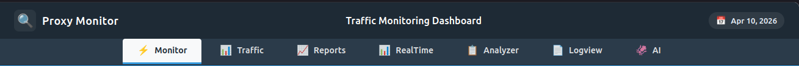](https://www.maravento.com/)

### MONITOR (Squidmon)

[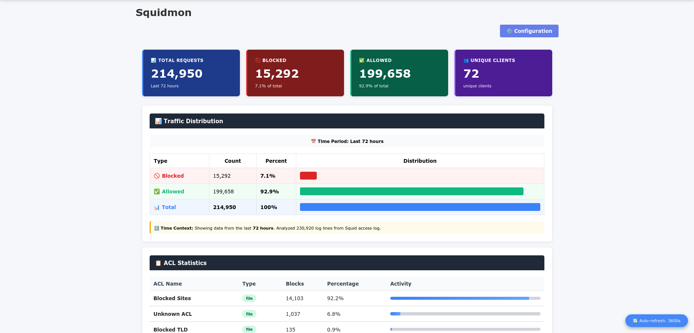](https://www.maravento.com/)

<table width="100%">
  <tr>
    <td style="width: 50%; vertical-align: top;">
     Squid Monitor (squidmon) provides detailed real-time traffic analysis and monitoring of your Squid proxy. It displays comprehensive statistics including blocked domains, blocked clients, traffic patterns, and ACL matching information. You can filter this activity and generate detailed reports on network traffic and blocked content.
    </td>
    <td style="width: 50%; vertical-align: top;">
     Squid Monitor (Squidmon) ofrece análisis del tráfico de Squid en tiempo real. Muestra estadísticas sobre dominios y clientes bloqueados, patrones de tráfico y coincidencias con las ACL. También permite filtrar la actividad y generar informes detallados sobre el tráfico de red y el contenido bloqueado.
    </td>
  </tr>
</table>

#### Config

[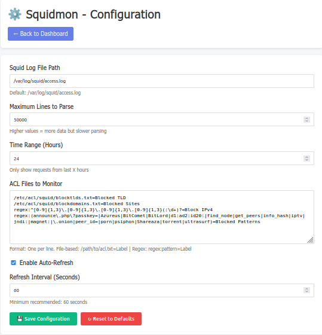](https://www.maravento.com/)

<table width="100%">
  <tr>
    <td style="width: 50%; vertical-align: top;">
      This section defines the parameters that Squid Monitor uses to interpret and display network activity, including data sources (access control lists —ACLs—), the maximum number of lines to analyze from the Squid log, the time range of the data, and the automatic refresh interval. Each list is declared with its full path, one per line, and the module reads exactly that path: it never searches any directory. These are the lists it ships with:
    </td>
    <td style="width: 50%; vertical-align: top;">
      Aquí se configuran los parámetros que Squid Monitor usa para mostrar la actividad de la red: las listas de control de acceso (ACL), el máximo de líneas del registro de Squid que se analizarán, el período de consulta y el intervalo de actualización. Cada lista se declara con su ruta completa, una por línea. El módulo lee esa ruta y no busca en ningún directorio. Estas son las listas que trae:
    </td>
  </tr>
</table>

```bash
/etc/acl/squid/blocktlds.txt=Blocked TLD
/etc/acl/squid/blockdomains.txt=Blocked Sites
regex:^[0-9]{1,3}\.[0-9]{1,3}\.[0-9]{1,3}\.[0-9]{1,3}(:\d+)?=Block IPv4
regex:(adlinkfly|announce\.php\?passkey=|info_hash|iptv|jndi:|mtc[0-9]|\.onion|peer_id=|porn|psiphon|torrent|ultrasurf)=Blocked Patterns
```

<table width="100%">
  <tr>
    <td style="width: 50%; vertical-align: top;">
      To change the lists, enter each full path in the <b>Config</b> section, one per line, followed by <code>=</code> and its label. Squid Monitor opens exactly that path and searches no directory. If you move a list, edit its line in <b>Config</b>.
    </td>
    <td style="width: 50%; vertical-align: top;">
      Para cambiar las listas, indique en la sección <b>Config</b> la ruta completa de cada archivo, una por línea, seguida de <code>=</code> y su etiqueta. Squid Monitor abre esa ruta y no busca en ninguna carpeta. Si cambia una lista de sitio, edite su línea en <b>Config</b>.
    </td>
  </tr>
</table>

```bash
sudo nano /etc/proxymon/proxymon.env
# path to ACLs folder
ACL_PATH=/etc/acl
```

<table width="100%">
  <tr>
    <td style="width: 50%; vertical-align: top;">
      <b>⚠️ Important:</b> For a rule to block traffic, it must be defined in both Squidmon configuration and <code>squid.conf</code>. Here is an example using the default ACLs:
    </td>
    <td style="width: 50%; vertical-align: top;">
      <b>⚠️ Importante:</b> Para que una regla bloquee tráfico, debe estar definida tanto en la configuración de Squidmon como en <code>squid.conf</code>. Este es un ejemplo con las ACL predeterminadas:
    </td>
  </tr>
</table>

```bash
sudo nano /etc/squid/squid.conf
#
# INSERT YOUR OWN RULE(S) HERE TO ALLOW ACCESS FROM YOUR CLIENTS
#
include /etc/squid/conf.d/*.conf
# Block: TLDs
# For more information visit: https://github.com/maravento/proxymon
acl blocktlds dstdomain "/etc/acl/squid/blocktlds.txt"
http_access deny workdays blocktlds
# Block: domains
acl blockdomains dstdomain "/etc/acl/squid/blockdomains.txt"
http_access deny workdays blockdomains
```

<table width="100%">
  <tr>
    <td style="width: 50%; vertical-align: top;">
      <b style="color: #d9534f;">⚠️ Warning:</b> Default values are <b>24 hours</b> and <b>50,000 lines</b> from <i>access.log</i>. Increasing these values may slow down the module and raise system resource usage. Refer to the <b>Squidmon Search</b> section. To reset the filters to their default values, press the <b>Reset to Default</b> button.
    </td>
    <td style="width: 50%; vertical-align: top;">
      <b style="color: #d9534f;">⚠️ Advertencia:</b> Los valores predeterminados son <b>24 horas</b> y <b>50&nbsp;000 líneas</b> de <i>access.log</i>. Si los aumenta, el módulo podría tardar más y consumir más recursos. Consulte la sección <b>Squidmon Search</b>. Para restablecer los valores iniciales, pulse <b>Reset to Default</b>.
    </td>
  </tr>
</table>

#### Top Blocked Domains & Clients

[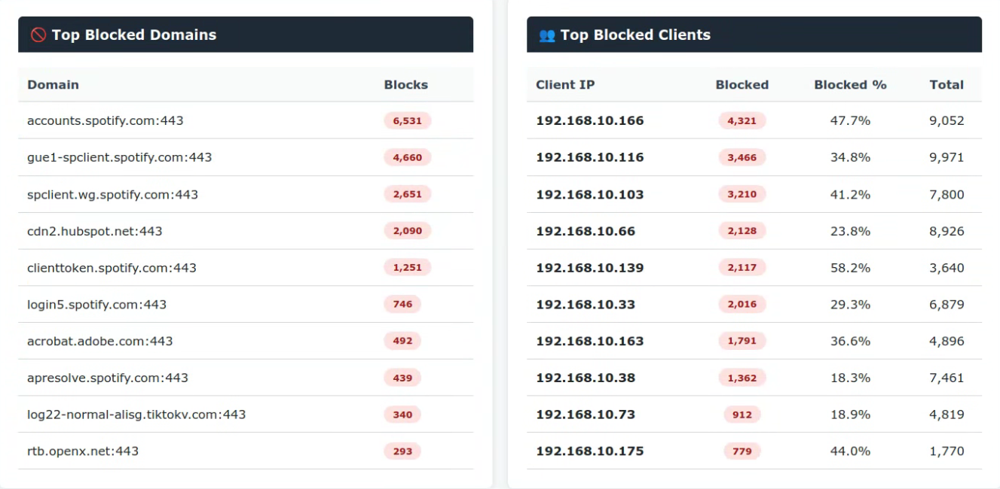](https://www.maravento.com/)

<table width="100%">
  <tr>
    <td style="width: 50%; vertical-align: top;">
     <b>Top Blocked Domains:</b> Shows the domains Squid blocks most often, along with the port and number of blocked requests. This helps identify frequently blocked sites or services and adjust access rules.
    </td>
    <td style="width: 50%; vertical-align: top;">
     <b>Top Blocked Domains:</b> Muestra los dominios que Squid bloquea con mayor frecuencia, junto con el puerto y el número de solicitudes bloqueadas. Esta información ayuda a identificar qué sitios o servicios se bloquean más y a ajustar las reglas de acceso.
    </td>
  </tr>
  <tr>
    <td style="width: 50%; vertical-align: top;">
     <b>Top Blocked Clients:</b> Shows the client IP addresses with the most blocked requests. Each row includes the total number of requests, how many were blocked, and the percentage they represent. This helps identify clients that often try to access restricted content and may need follow-up.
    </td>
    <td style="width: 50%; vertical-align: top;">
     <b>Top Blocked Clients:</b> Muestra las IP de los clientes con más solicitudes bloqueadas. Cada fila incluye el total de solicitudes, cuántas se bloquearon y qué porcentaje representan. Así puedes identificar equipos que intentan acceder con frecuencia a contenido restringido y decidir si requieren seguimiento.
    </td>
  </tr>
</table>

#### Traffic by Client IP

[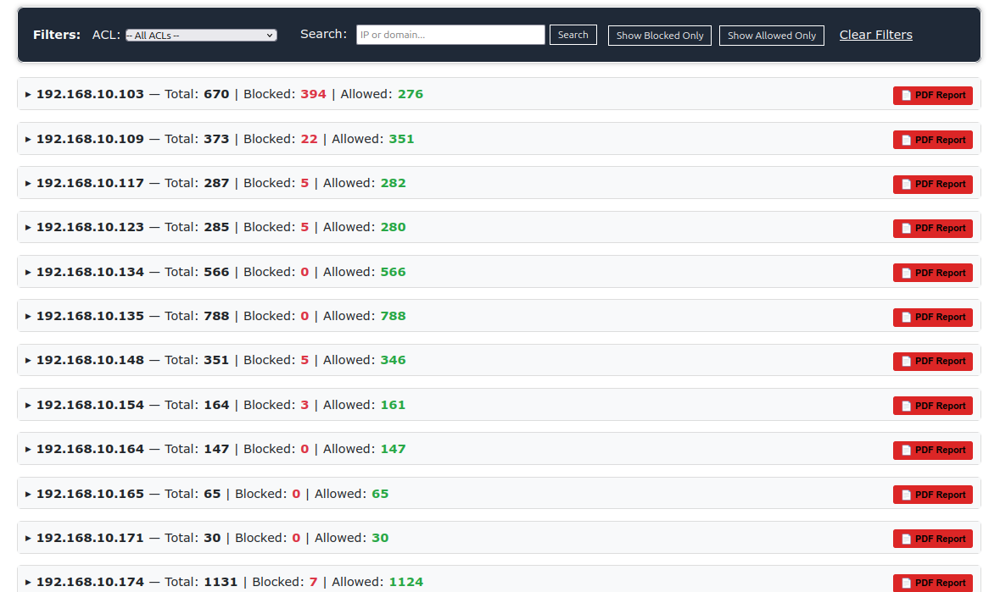](https://www.maravento.com/)

<table width="100%">
  <tr>
    <td style="width: 50%; vertical-align: top;">
     Expand a client IP to view its traffic statistics, including total, blocked, and allowed requests. <br>
     <br>
     Filter by ACL, search for IP addresses or domains, and select a period of 24 hours, 7 days, or 30 days. <br>
     <br>
     You can also generate a PDF report for each client.
    </td>
    <td style="width: 50%; vertical-align: top;">
     Permite desplegar las IP de los clientes y consultar, para cada una, el total de solicitudes y cuántas fueron bloqueadas o permitidas. <br>
     <br>
     Puedes filtrar por ACL, buscar IP o dominios y consultar períodos de 24 horas, 7 días o 30 días. <br>
     <br>
     También puedes generar un informe PDF para cada cliente.
    </td>
  </tr>
</table>

#### Filtering and Search

[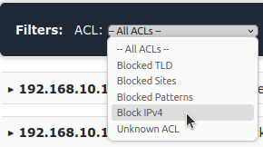](https://www.maravento.com/)

<table width="100%">
  <tr>
    <td style="width: 50%; vertical-align: top;">
     Squidmon classifies traffic using ACLs (Access Control Lists), such as <b>Blocked TLD</b>, <b>Blocked Sites</b>, <b>Blocked Patterns</b>, <b>Block IPv4</b> and <b>Unknown ACL</b>. The last one covers any rule defined in <code>squid.conf</code> that is not among the ACLs listed in Config. <br>
     <br>
     Search by IP address or domain, and filter to show only blocked or only allowed traffic. <br>
     <br>
     Select <b>Clean Filters</b> to clear the filters.
    </td>
    <td style="width: 50%; vertical-align: top;">
     Squidmon clasifica el tráfico según las ACL, como <b>Blocked TLD</b>, <b>Blocked Sites</b>, <b>Blocked Patterns</b>, <b>Block IPv4</b> y <b>Unknown ACL</b>. Esta última agrupa las reglas de <code>squid.conf</code> que no aparecen en la sección <b>Config</b>. <br>
     <br>
     Puedes buscar por IP o dominio y filtrar para ver solo el tráfico bloqueado o solo el permitido. <br>
     <br>
     Pulsa <b>Clean Filters</b> para borrar los filtros.
    </td>
  </tr>
</table>

#### Report Generation

[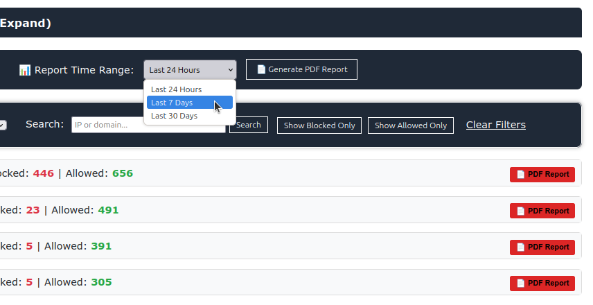](https://www.maravento.com/)

<table width="100%">
  <tr>
    <td style="width: 50%; vertical-align: top;">
     Generate PDF traffic reports. <br>
     <br>
     Choose the last 24 hours, 7 days, or 30 days. You can also create a report for a client or domain and share it with anyone. <br>
     <br>
     The <b>Generate PDF Report</b> button appears in the interface.
    </td>
    <td style="width: 50%; vertical-align: top;">
     Puedes generar informes PDF de tráfico. <br>
     <br>
     Puedes elegir las últimas 24 horas, los últimos 7 días o los últimos 30 días, y generar un informe para un cliente o dominio para compartirlo con quien quieras. <br>
     <br>
     El botón <b>Generate PDF Report</b> aparece en la interfaz.
    </td>
  </tr>
</table>

#### Blocked URLs Analysis

[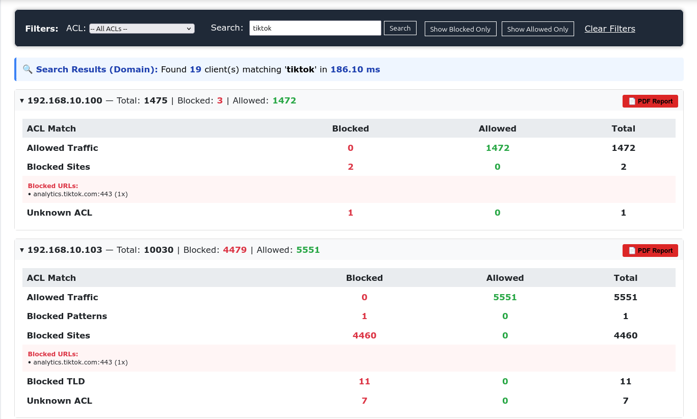](https://www.maravento.com/)

<table width="100%">
  <tr>
    <td style="width: 50%; vertical-align: top;">
     Expand a client IP to see the blocked URLs, the matching ACL rule (for example, <b>Blocked Sites</b>), and how many times each URL was requested. This helps identify browsing patterns and adjust access rules.
    </td>
    <td style="width: 50%; vertical-align: top;">
     Al desplegar una IP, puedes consultar las URL bloqueadas, la regla de ACL que coincidió —por ejemplo, <b>Blocked Sites</b>— y cuántas veces se solicitó cada URL. Estos datos ayudan a reconocer patrones de navegación y ajustar las reglas de acceso.
    </td>
  </tr>
</table>

#### Patterns

[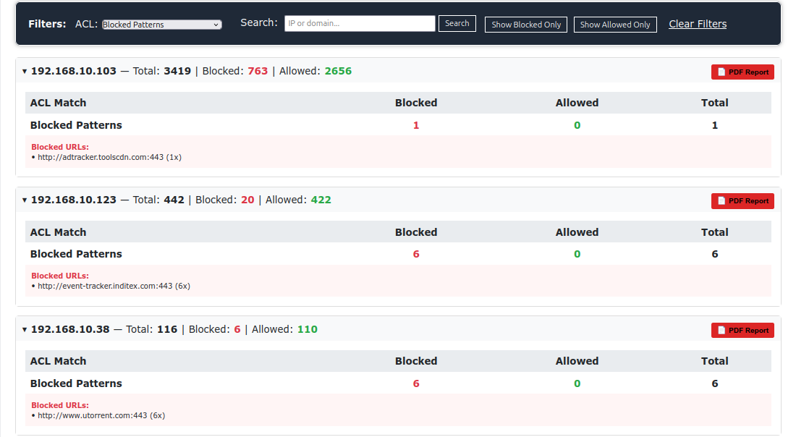](https://www.maravento.com/)

<table width="100%">
  <tr>
    <td style="width: 50%; vertical-align: top;">
     If a Squid ACL uses <code>url_regex</code>, Squid Monitor cannot read it from a file. Enter the expression directly in the module's <b>Config</b> section, as shown here:
    </td>
    <td style="width: 50%; vertical-align: top;">
     Si una ACL de Squid usa <code>url_regex</code>, Squid Monitor no puede leerla desde un archivo. Copie su expresión directamente en la sección <b>Config</b> del módulo, como en este ejemplo:
    </td>
  </tr>
</table>

```bash
regex:(adlinkfly|announce\.php\?passkey=|info_hash|iptv|jndi:|mtc[0-9]|\.onion|peer_id=|porn|psiphon|torrent|ultrasurf)=Blocked Patterns
regex:^[0-9]{1,3}\.[0-9]{1,3}\.[0-9]{1,3}\.[0-9]{1,3}(:\d+)?=Block IPv4
```

#### Squidmon Search

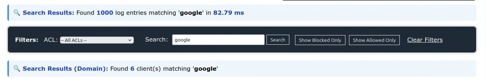

<table width="100%">
  <tr>
    <td style="width: 50%; vertical-align: top;">
      <b>Result:</b> 6 clients found in <b>0.08 seconds</b>. Client IP-based filtering with domain resolution.<br>
      <b>Data Source:</b> Squid access logs <code>/var/log/squid/access.log</code><br>
      <b>Search Method:</b> Real-time log parsing with ACL filtering<br>
      <b>Use Case:</b> Real-time client activity, immediate threat detection<br>
    </td>
    <td style="width: 50%; vertical-align: top;">
      <b>Resultado:</b> 6 clientes encontrados en <b>0.08 s</b>. Filtrado basado en IP del cliente con resolución de dominio.<br>
      <b>Fuente de Datos:</b> Registros de acceso de Squid <code>/var/log/squid/access.log</code><br>
      <b>Método de Búsqueda:</b> Análisis de registros en tiempo real con filtrado ACL<br>
      <b>Caso de Uso:</b> Actividad de cliente en tiempo real, detección inmediata de amenazas<br>
    </td>
  </tr>
</table>

#### Logrotate

<table width="100%">
  <tr>
    <td style="width: 50%; vertical-align: top;">
     Squidmon reads only the current <code>access.log</code>; it does not process rotated files. <br>
     <br>
     Disable Squid's internal rotation with <code>logfile_rotate 0</code>, then configure <code>logrotate</code> to rotate the file at a frequency that suits your network, such as weekly or monthly. <br>
     <br>
     In <code>/etc/logrotate.d/squid</code>, you can keep seven rotations with <code>rotate 7</code>.
    </td>
    <td style="width: 50%; vertical-align: top;">
     Squidmon solo lee el <code>access.log</code> actual; no procesa los archivos rotados. <br>
     <br>
     Desactive la rotación interna de Squid con <code>logfile_rotate 0</code> y configure <code>logrotate</code> para rotar el archivo con una frecuencia adecuada para su red, por ejemplo semanal o mensual. <br>
     <br>
     En <code>/etc/logrotate.d/squid</code>, puedes conservar siete rotaciones con <code>rotate 7</code>.
    </td>
  </tr>
</table>

```bash
# Disable Squid internal rotation
sudo nano /etc/squid/squid.conf
#  TAG: logfile_rotate
logfile_rotate 0

# Logrotate
sudo sed -i 's/^	daily$/	weekly/' /etc/logrotate.d/squid
# or
sudo sed -i 's/^	daily$/	monthly/' /etc/logrotate.d/squid
# Optional:
sudo sed -i 's/rotate 2/rotate 7/' /etc/logrotate.d/squid
```

### TRAFFIC (Lightsquid)

[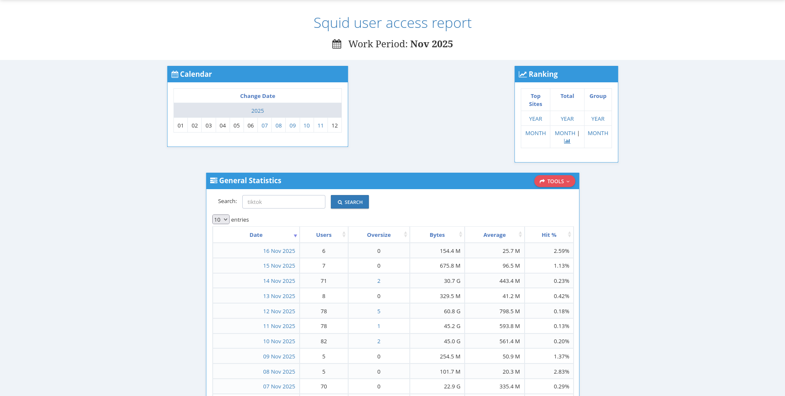](https://www.maravento.com/)

#### Error

[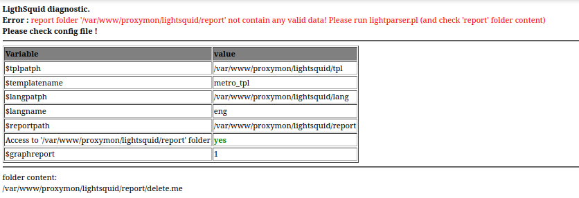](https://www.maravento.com/)

<table width="100%">
  <tr>
    <td style="width: 50%; vertical-align: top;">
     The first time you open <b>Traffic (LightSquid)</b>, reports may not be available yet. This happens if they have not been generated or your network traffic has not passed through Squid. The installer attempts to generate the initial report; if it does not appear, run this command:
    </td>
    <td style="width: 50%; vertical-align: top;">
     La primera vez que abras <b>Traffic (LightSquid)</b>, puede que todavía no haya informes. Esto ocurre si aún no se han generado o si el tráfico de la red no ha pasado por Squid. El instalador intenta generar el informe inicial; si no aparece, ejecuta este comando:
    </td>
  </tr>
</table>

```bash
sudo /var/www/proxymon/lightsquid/lightparser.pl today
```

#### Search Bar

[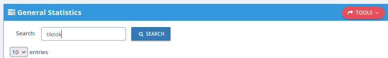](https://www.maravento.com/)

<table width="100%">
  <tr>
    <td style="width: 50%; vertical-align: top;">
      In <b>General Statistics</b>, enter a word or value in the search bar and select <b>SEARCH</b>. The table will show matching rows, so you do not have to scan the entire report.
    </td>
    <td style="width: 50%; vertical-align: top;">
      En <b>General Statistics</b>, escribe una palabra o un valor en la barra de búsqueda y pulsa <b>SEARCH</b>. La tabla mostrará las filas coincidentes, sin que tengas que recorrer todo el informe.
    </td>
  </tr>
</table>

[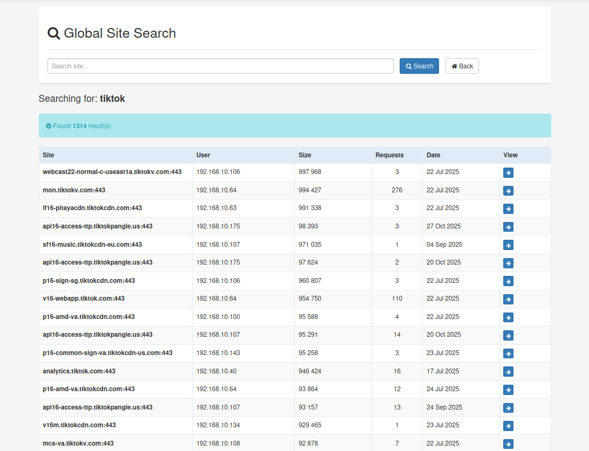](https://www.maravento.com/)

#### Traffic Search

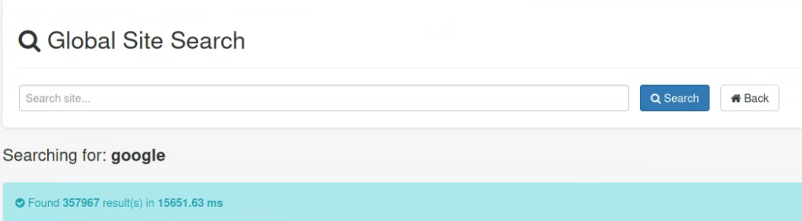

<table width="100%">
  <tr>
    <td style="width: 50%;">
      <b>Result:</b> 1,323 matches in <b>5.4 seconds</b>. The search scans LightSquid daily reports for the entered term, regardless of letter case.<br><br>
      <b>Data Source:</b> LightSquid reports<br>
      <code>/var/www/proxymon/lightsquid/report/YYYYMMDD/</code><br><br>
      <b>Search Method:</b> Reads report files and searches for the literal term<br><br>
      <b>Use Case:</b> Historical analysis, domain trends, bandwidth reports
    </td>
    <td style="width: 50%;">
      <b>Resultado:</b> 1 323 coincidencias en <b>5,4 s</b>. La búsqueda recorre los informes diarios de LightSquid y encuentra el texto indicado, sin distinguir mayúsculas de minúsculas.<br><br>
      <b>Fuente de Datos:</b> Reportes de LightSquid<br>
      <code>/var/www/proxymon/lightsquid/report/YYYYMMDD/</code><br><br>
      <b>Método de Búsqueda:</b> Lectura de los archivos de informes y búsqueda literal del término<br><br>
      <b>Caso de Uso:</b> Análisis histórico, tendencias de dominios, reportes de ancho de banda
    </td>
  </tr>
</table>

#### Traffic Cron Job

<table width="100%">
  <tr>
    <td style="width: 50%; vertical-align: top;">
     The installer schedules LightSquid report generation every 10 minutes. To change the frequency, edit its entry in <code>/etc/cron.d/proxymon</code>.
    </td>
    <td style="width: 50%; vertical-align: top;">
     El instalador programa la generación de informes de LightSquid cada 10 minutos. Para cambiar la frecuencia, edita la tarea de LightSquid en <code>/etc/cron.d/proxymon</code>.
    </td>
  </tr>
</table>

```bash
sudo -u www-data crontab -e
*/10 * * * * /var/www/proxymon/lightsquid/lightparser.pl today
```

#### Add Users

<table width="100%">
  <tr>
    <td style="width: 50%; vertical-align: top;">
     You can add users manually to <code>realname.cfg</code> and exclude IP addresses from reports with <code>skipuser.cfg</code>.<br><br>
     <em>Note: <b>when <code>UPDATE_REALNAME=true</code>—the default for a new installation—Bandata generates <code>realname.cfg</code> from non-excluded MAC ACLs and, when enabled, data from <code>uhm-auth.txt</code>. It also generates <code>skipuser.cfg</code> from the IP addresses in <code>mac-unlimited.txt</code> and IPv4 entries in <code>/etc/hosts</code>. If it finds data, it replaces the contents of those files, so manual edits may be lost.</em>
    </td>
    <td style="width: 50%; vertical-align: top;">
     Puedes añadir usuarios manualmente a <code>realname.cfg</code> y excluir IP de los informes con <code>skipuser.cfg</code>.<br><br>
     <em>Nota: cuando <code>UPDATE_REALNAME=true</code> —valor predeterminado al instalar—, Bandata genera <code>realname.cfg</code> con las ACL MAC no excluidas y, si corresponde, los datos de <code>uhm-auth.txt</code>. También genera <code>skipuser.cfg</code> con las IP de <code>mac-unlimited.txt</code> y las direcciones IPv4 de <code>/etc/hosts</code>. Si encuentra datos, reemplaza el contenido de esos archivos, por lo que los cambios manuales pueden perderse.</em>
     </td>
  </tr>
</table>

```bash
sudo nano /var/www/proxymon/lightsquid/realname.cfg
# example:
192.168.X.2 Client1
192.168.X.24 Client12
sudo nano /var/www/proxymon/lightsquid/skipuser.cfg
# example:
192.168.X.3 CEO
```

#### Exclude Users

<table width="100%">
  <tr>
    <td style="width: 50%; vertical-align: top;">
     To exclude IP addresses from reports, add them to <code>skipuser.cfg</code>. If <code>UPDATE_REALNAME=true</code>, Bandata normally rebuilds this file from <code>mac-unlimited.txt</code> and <code>/etc/hosts</code>, so manual changes may be replaced:
    </td>
    <td style="width: 50%; vertical-align: top;">
     Para excluir IP de los informes, añádelas a <code>skipuser.cfg</code>. Si <code>UPDATE_REALNAME=true</code>, Bandata normalmente vuelve a generar este archivo a partir de <code>mac-unlimited.txt</code> y <code>/etc/hosts</code>, por lo que puede reemplazar los cambios manuales:
    </td>
  </tr>
</table>

```bash
sudo nano /var/www/proxymon/lightsquid/skipuser.cfg
# example
192.168.X.1
```

#### Netscan

<table width="100%">
  <tr>
    <td style="width: 50%; vertical-align: top;">
     To scan the devices on your local network, choose any of the following commands along with your network's IP range. e.g.:
    </td>
    <td style="width: 50%; vertical-align: top;">
     Para escanear los dispositivos de su red local, elija cualquiera de estos comandos y el rango de IP de su red. ej:
    </td>
  </tr>
</table>

```bash
# Install required tools
sudo apt install -y nbtscan nmap arp-scan nast sudo netdiscover
# Run the following commands to scan your local network:
# 1. Using nbtscan
sudo nbtscan 192.168.X.0/24
# 2. Using nmap
sudo nmap -sn 192.168.X.0/24
# 3. Using arp-scan
sudo arp-scan --localnet
# 4. Using nast
sudo nast -m
# 5. Using netdiscover
sudo netdiscover
```

#### Lightsquid Theme

<table width="100%">
  <tr>
    <td style="width: 50%; vertical-align: top;">
     LightSquid includes two themes: <b>metro</b>, the default, and <b>base</b>, which has an older design.
    </td>
    <td style="width: 50%; vertical-align: top;">
     LightSquid incluye dos temas: <b>metro</b>, el predeterminado, y <b>base</b>, de diseño más antiguo.
    </td>
  </tr>
</table>

```bash
sudo nano /var/www/proxymon/lightsquid/lightsquid.cfg
#$templatename        ="base";
$templatename        ="metro_tpl";
```

#### Data Statistics

<table width="100%">
  <tr>
    <td style="width: 50%; vertical-align: top;">
     LightSquid displays traffic statistics and identifies users who exceed the configured threshold. To change that threshold, edit <code>lightsquid.cfg</code>:
    </td>
    <td style="width: 50%; vertical-align: top;">
     LightSquid muestra las estadísticas de tráfico y señala a los usuarios que superan el umbral configurado. Para cambiar ese umbral, edita <code>lightsquid.cfg</code>:
    </td>
  </tr>
</table>

```bash
sudo nano /var/www/proxymon/lightsquid/lightsquid.cfg

# Nomenclature: 10 = 10 MBytes, 512 = 512 Mbytes, 1000 = 1 Gbytes...
# By default it comes in 1000. Do not modify the value 1024.

#user maximum size per day limit (oversize)
$perusertrafficlimit = 1000*1024*1024;
```

#### Export Tools

[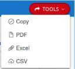](https://www.maravento.com/)

<table width="100%">
  <tr>
    <td style="width: 50%; vertical-align: top;">
      In <b>General Statistics</b>, open <b>Tools</b> on the right side of the header to copy or print the table, or export it as PDF, XLSX, or CSV.
    </td>
    <td style="width: 50%; vertical-align: top;">
      En <b>General Statistics</b>, abre <b>Tools</b>, a la derecha del encabezado, para copiar o imprimir la tabla y exportarla como PDF, XLSX o CSV.
    </td>
  </tr>
</table>

#### Reports

<table width="100%">
  <tr>
    <td style="width: 50%; vertical-align: top;">
     LightSquid can export reports, but its site view shows a selection of top domains. To collect the domains recorded in the daily reports and create a list for a Squid ACL, run:
    </td>
    <td style="width: 50%; vertical-align: top;">
     LightSquid permite exportar informes, pero su vista de sitios muestra una selección de los dominios principales. Para reunir los dominios registrados en los informes diarios y generar una lista para una ACL de Squid, ejecuta:
    </td>
  </tr>
</table>

```bash
find /var/www/proxymon/lightsquid/report -type f -name '[0-9]*.[0-9]*.[0-9]*.[0-9]*' -exec grep -oE '[[:alnum:]_.-]+\.([[:alnum:]_.-]+)+' {} \; | sed 's/^\.//' | sed -r 's/^(www|ftp|ftps|ftpes|sftp|pop|pop3|smtp|imap|http|https)\.//g' | sed -r '/^[0-9]{1,3}(\.[0-9]{1,3}){3}$/d' | tr -d ' ' | awk '{print "." $1}' | sort -u > domains.txt
```

#### BanData

[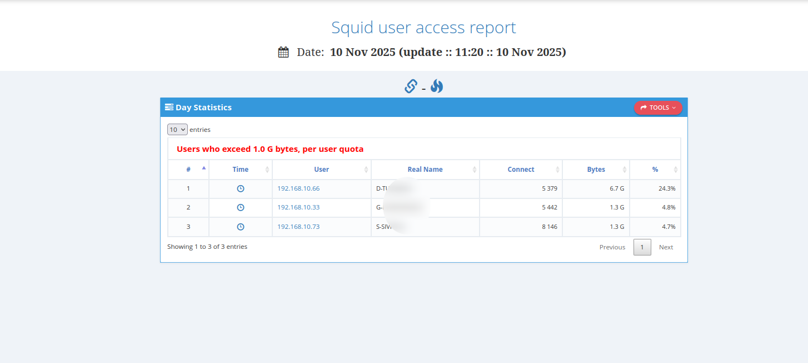](https://www.maravento.com/)

<table width="100%">
  <tr>
    <td style="width: 50%; vertical-align: top;">
      Bandata is a script that sets data usage limits —daily, weekly, and monthly— for IP addresses on a LAN monitored with Squid, and automatically blocks those that exceed the established quotas.
      <br><br>
      <strong>Notes:</strong>
      <ul>
        <li>Weekends are excluded from the calculation.</li>
        <li>The limits must match those configured in Squid Report.</li>
        <li>Bandata can generate <code>realname.cfg</code> to map IP addresses to names and <code>skipuser.cfg</code> to exclude IP addresses from LightSquid reports. It reads MAC ACLs, <code>/etc/hosts</code>, and, when enabled, the captive portal's <code>uhm-auth.txt</code>.</li>
        <li>On its first run Bandata writes <code>/etc/logrotate.d/bandata</code> if that file is missing, so <code>/var/log/bandata.log</code> never needs a manual truncate. The generated rule rotates the log daily, keeps seven rotations compressed, and recreates it as <code>640 root adm</code>. An existing file is left untouched, so your own changes are preserved.</li>
      </ul>
    </td>
    <td style="width: 50%; vertical-align: top;">
      Bandata es un script que establece límites de consumo de datos —diario, semanal y mensual— para direcciones IP de una LAN monitorizada con Squid, y bloquea automáticamente aquellas que superan las cuotas establecidas.
      <br><br>
      <strong>Notas:</strong>
      <ul>
        <li>Los fines de semana quedan excluidos del cálculo.</li>
        <li>Los límites deben coincidir con los configurados en Squid Report.</li>
        <li>Bandata puede generar <code>realname.cfg</code> para asociar IP con nombres y <code>skipuser.cfg</code> para excluir IP de los informes de LightSquid. Toma los datos de las ACL MAC, de <code>/etc/hosts</code> y, si está activado, de <code>uhm-auth.txt</code> del portal cautivo.</li>
        <li>En su primera ejecución, Bandata crea <code>/etc/logrotate.d/bandata</code> si ese archivo no existe, por lo que <code>/var/log/bandata.log</code> nunca necesita un truncado manual. La regla generada rota el log a diario, conserva siete rotaciones comprimidas y lo recrea como <code>640 root adm</code>. Si el archivo ya existe, no lo modifica, así que tus cambios se conservan.</li>
      </ul>
    </td>
  </tr>
</table>

```bash
# Bandata - Monitor bandwidth usage and enforce data limits (every 5 minutes)
sudo crontab -e
*/5 * * * * /etc/proxymon/bandata/bandata.sh
```

[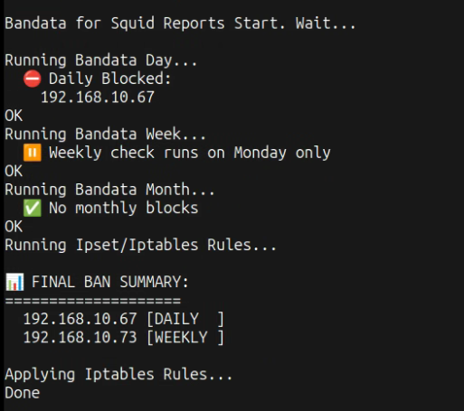](https://www.maravento.com/)

##### Warning Portal

[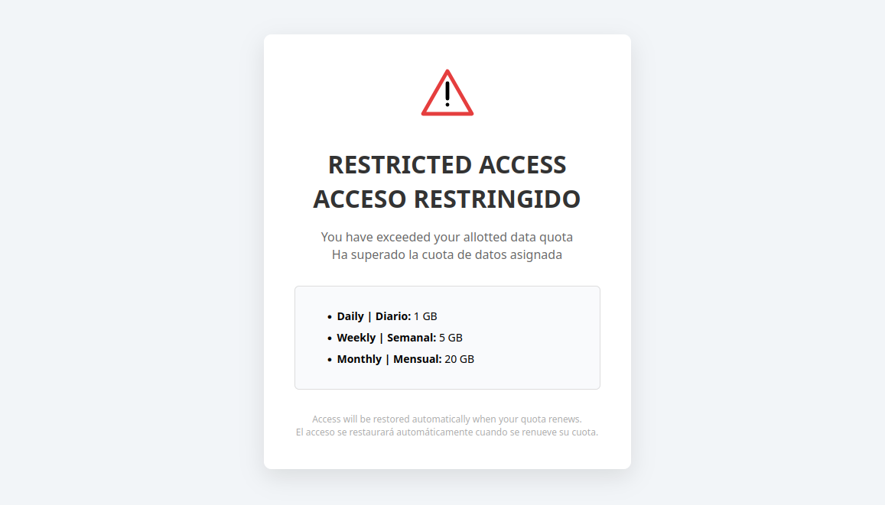](https://www.maravento.com/)

<table width="100%">
  <tr>
    <td style="width: 50%; vertical-align: top;">
     When an IP address exceeds its daily, weekly, or monthly quota, Bandata redirects its HTTP traffic to the Warning portal. Other traffic is blocked:
    </td>
    <td style="width: 50%; vertical-align: top;">
     Cuando una IP supera su cuota diaria, semanal o mensual, Bandata redirige su tráfico HTTP al portal de advertencia (Warning) y bloquea el resto del tráfico:
    </td>
  </tr>
</table>

```bash
http://192.168.X.X:18081
```

##### Banned IPs

<table width="100%">
  <tr>
    <td style="width: 50%; vertical-align: top;">
     To view the blocked IP addresses:
    </td>
    <td style="width: 50%; vertical-align: top;">
     Para consultar las IP bloqueadas:
    </td>
  </tr>
</table>

```bash
cat /etc/proxymon/bandata/acl/{banmonth,banweek,banday}.txt | uniq
```

##### Data Limit

<table width="100%">
  <tr>
    <td style="width: 50%; vertical-align: top;">
     You can enter limits in gigabytes, megabytes, or bytes; for example, <code>0.5G</code>, <code>512M</code>, or <code>536870912</code>. The default limits are 1 GB per day, 5 GB per week, and 20 GB per month.
    </td>
    <td style="width: 50%; vertical-align: top;">
     Puedes indicar los límites en gigabytes, megabytes o bytes; por ejemplo, <code>0.5G</code>, <code>512M</code> o <code>536870912</code>. Los valores predeterminados son 1 GB al día, 5 GB a la semana y 20 GB al mes.
    </td>
  </tr>
</table>

##### By Day

<table width="100%">
  <tr>
    <td style="width: 50%; vertical-align: top;">
     Bandata compares the day's usage with the daily limit and blocks IP addresses that exceed it. On each weekday run, it recalculates the daily list from that day's report; it clears the list on weekends. An IP address is no longer blocked by the daily quota once it disappears from that list, though it may remain blocked if it appears in the weekly or monthly list. To change the daily limit, edit <code>/etc/proxymon/proxymon.env</code>:
    </td>
    <td style="width: 50%; vertical-align: top;">
     Bandata compara el consumo del día con el límite diario y bloquea las IP que lo superan. En cada ejecución de lunes a viernes recalcula la lista diaria con el informe de ese día; durante el fin de semana la vacía. La IP deja de estar bloqueada por cuota diaria cuando desaparece de esa lista, aunque puede seguir bloqueada si aparece en la lista semanal o mensual. Para cambiar el límite diario, edita <code>/etc/proxymon/proxymon.env</code>:
    </td>
  </tr>
</table>

```bash
MAX_BANDWIDTH_DAY=1G
```

##### By Week

<table width="100%">
  <tr>
    <td style="width: 50%; vertical-align: top;">
     Every Monday, Bandata totals the usage recorded from Monday to Friday of the previous week and updates the weekly list. If an IP address exceeds the limit (5 GB by default), it remains blocked under the weekly quota until a later Monday calculation removes it from that list. It may also remain blocked if it appears in the daily or monthly list. To change the weekly limit, edit <code>/etc/proxymon/proxymon.env</code>:
    </td>
    <td style="width: 50%; vertical-align: top;">
     Cada lunes, Bandata suma el consumo registrado de lunes a viernes de la semana anterior y actualiza la lista semanal. Si una IP supera el límite —5 GB de forma predeterminada—, permanece bloqueada por cuota semanal hasta que el cálculo de un lunes posterior la quite de esa lista. También puede seguir bloqueada si aparece en la lista diaria o mensual. Para cambiar el límite semanal, edita <code>/etc/proxymon/proxymon.env</code>:
    </td>
  </tr>
</table>

```bash
MAX_BANDWIDTH_WEEK=5G
```

##### By Month

<table width="100%">
  <tr>
    <td style="width: 50%; vertical-align: top;">
     On every run, Bandata totals usage recorded on weekdays in the current month and updates the monthly list. If an IP address exceeds the limit (20 GB by default), it remains blocked under the monthly quota while it appears on that list. At the start of the next month, the list is calculated from the new month's reports, removing blocks that applied only to the previous month. The IP may remain blocked if it appears in the daily or weekly list. To change the monthly limit, edit <code>/etc/proxymon/proxymon.env</code>:
    </td>
    <td style="width: 50%; vertical-align: top;">
     En cada ejecución, Bandata suma el consumo de los días hábiles del mes en curso y actualiza la lista mensual. Si una IP supera el límite —20 GB de forma predeterminada—, permanece bloqueada por cuota mensual mientras figure en esa lista. Al comenzar el mes siguiente, la lista se calcula con los informes del nuevo mes y elimina los bloqueos que solo correspondían al mes anterior. La IP puede seguir bloqueada si aparece en la lista diaria o semanal. Para cambiar el límite mensual, edita <code>/etc/proxymon/proxymon.env</code>:
    </td>
  </tr>
</table>

```bash
MAX_BANDWIDTH_MONTH=20G
```

<table width="100%">
  <tr>
    <td style="width: 50%; vertical-align: top;">
      Bandata forma el conjunto de IP bloqueadas uniendo las listas diaria, semanal y mensual. Una IP deja de estar bloqueada cuando ya no aparece en ninguna de las tres.
    </td>
    <td style="width: 50%; vertical-align: top;">
      Bandata builds the blocked IP set by combining the daily, weekly, and monthly lists. An IP address is unblocked only when it no longer appears in any of the three.
    </td>
  </tr>
</table>

### REPORTS (SARG)

[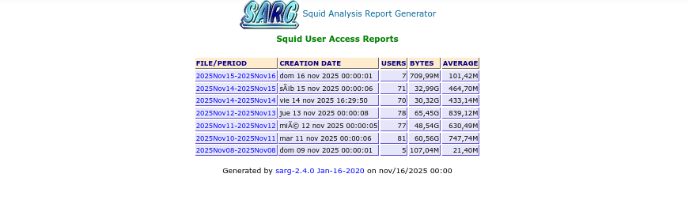](https://www.maravento.com/)

<table width="100%">
  <tr>
    <td style="width: 50%; vertical-align: top;">
      SARG (Squid Analysis Report Generator) provides detailed analysis of proxy traffic, generating comprehensive reports of user activity, bandwidth consumption, and accessed websites. It tracks connection statistics, data transfer volumes, cache efficiency, and elapsed time for each user or IP address on the network.
    </td>
    <td style="width: 50%; vertical-align: top;">
      SARG (Generador de Reportes de Análisis de Squid) proporciona análisis detallado del tráfico del proxy, generando reportes exhaustivos de la actividad de usuarios, consumo de ancho de banda y sitios web accedidos. Realiza un seguimiento de estadísticas de conexión, volúmenes de transferencia de datos, eficiencia de caché y tiempo transcurrido para cada usuario o dirección IP en la red.
    </td>
  </tr>
</table>

#### Global Report

[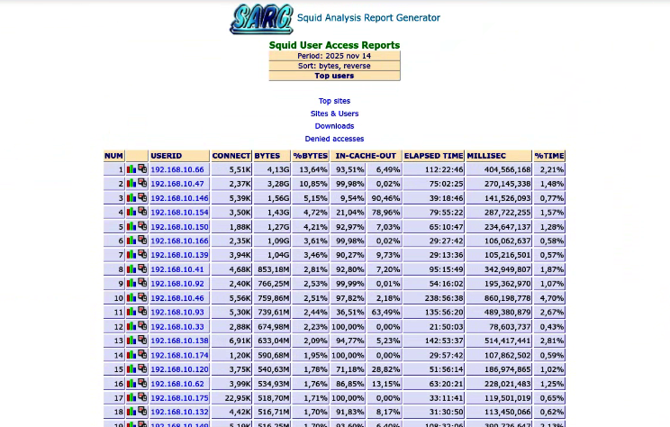](https://www.maravento.com/)

<table width="100%">
  <tr>
    <td style="width: 50%; vertical-align: top;">
      The Global Report displays aggregated traffic statistics across all users and IP addresses. It shows the top visited websites, total bandwidth usage, connection counts, cache hit rates, and data transfer patterns. This overview helps administrators identify traffic trends, peak usage periods, and overall network behavior patterns.
    </td>
    <td style="width: 50%; vertical-align: top;">
      El Reporte Global muestra estadísticas de tráfico agregadas en todos los usuarios y direcciones IP. Presenta los sitios web más visitados, uso total de ancho de banda, conteos de conexión, tasas de acierto de caché y patrones de transferencia de datos. Esta visión general ayuda a los administradores a identificar tendencias de tráfico, períodos de uso máximo y patrones generales de comportamiento de la red.
    </td>
  </tr>
</table>

#### Report by IP

[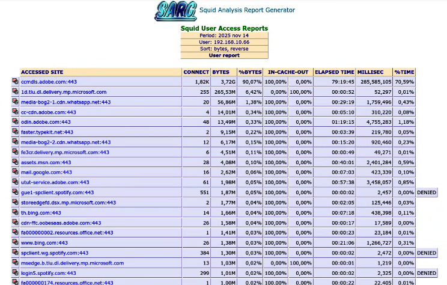](https://www.maravento.com/)

<table width="100%">
  <tr>
    <td style="width: 50%; vertical-align: top;">
      The IP Report provides granular analysis for individual users or machines. It details specific browsing activity, showing accessed URLs, bandwidth consumption per user, connection frequency, cache efficiency, and time spent online. This enables administrators to monitor individual user behavior and enforce bandwidth policies on specific network devices.
    </td>
    <td style="width: 50%; vertical-align: top;">
      El Reporte por IP proporciona análisis detallado para usuarios o máquinas individuales. Detalla la actividad de navegación específica, mostrando URLs accedidas, consumo de ancho de banda por usuario, frecuencia de conexión, eficiencia de caché y tiempo dedicado en línea. Esto permite a los administradores monitorear el comportamiento de usuarios individuales e implementar políticas de ancho de banda en dispositivos de red específicos.
    </td>
  </tr>
</table>

#### Report Rotation and Cleanup

<table width="100%">
  <tr>
    <td style="width: 50%; vertical-align: top;">
      SARG processes logs from the last 7 days, as set by <code>lastlog 7</code> in <code>/etc/sarg/sarg.conf</code>. <br>
      <br>
      Separately, a weekly task deletes SARG report directories older than 30 days. <br>
      <br>
      To change these periods, edit both the configuration file and the scheduled task:
    </td>
    <td style="width: 50%; vertical-align: top;">
      SARG procesa los registros de los últimos 7 días, según el parámetro <code>lastlog 7</code> de <code>/etc/sarg/sarg.conf</code>. <br>
      <br>
      Por separado, una tarea semanal elimina los directorios de informes de SARG que tengan más de 30 días. <br>
      <br>
      Para cambiar estos períodos, modifica tanto el archivo de configuración como la tarea programada:
    </td>
  </tr>
</table>

```bash
# Edit Sarg Config
sudo nano /etc/sarg/sarg.conf
# Change 7 to the desired number of days
lastlog 7 
# Edit crontab
sudo -u www-data crontab -l
# Replace: -mtime +30 with the desired number of days
@weekly find /var/www/proxymon/sarg/squid-reports -name "2*" -mtime +30 -type d -exec rm -rf "{}" \; &> /dev/null
# Restart cron
sudo systemctl restart cron
```

### REALTIME (SQSTAT)

[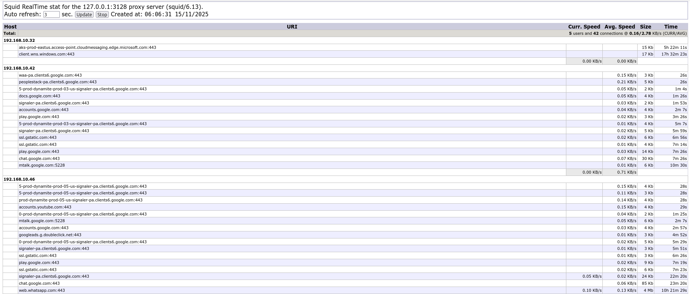](https://www.maravento.com/)

<table width="100%">
  <tr>
    <td style="width: 50%; vertical-align: top;">
     <b>SqStat</b> shows the proxy's active connections. It uses the Cache Manager (cachemgr) protocol to query Squid.
    </td>
    <td style="width: 50%; vertical-align: top;">
     <b>SqStat</b> muestra las conexiones activas del proxy. Para consultar Squid, usa el protocolo Cache Manager (cachemgr).
    </td>
  </tr>
</table>

<table width="100%">
  <tr>
    <td style="width: 50%; vertical-align: top;">
     The password in <code>sqstat/config.inc.php</code>, <code>$cachemgr_passwd[0]="mypass";</code>, must match the <code>cachemgr_passwd</code> directive of your Squid in <code>squid.conf</code>, <code>cachemgr_passwd mypass all</code>. <br>
     <br>
     If you do not use those directives at all, leave both blank or commented out. <br>
     <br>
     <code>install</code> fills this in automatically with the local user detected on the system. Edit it by hand afterwards if you use a different password in <code>squid.conf</code>.
    </td>
    <td style="width: 50%; vertical-align: top;">
     La contraseña en <code>sqstat/config.inc.php</code>, <code>$cachemgr_passwd[0]="mipass";</code>, debe coincidir con la directiva <code>cachemgr_passwd</code> de su Squid en <code>squid.conf</code>, <code>cachemgr_passwd mipass all</code>. <br>
     <br>
     Si no usa esas directivas, deje ambas en blanco o comentadas. <br>
     <br>
     <code>install</code> la completa automáticamente con el usuario local detectado en el sistema. Edítela a mano después si usa otra contraseña en <code>squid.conf</code>.
    </td>
  </tr>
</table>

<table width="100%">
  <tr>
    <td style="width: 50%; vertical-align: top;">
     <b>Important:</b> SqStat connects to Squid from the same server where the panel runs, using <code>$squidhost[0]</code> and <code>$squidport[0]</code> from <code>sqstat/config.inc.php</code>. The default is <code>127.0.0.1</code>. <br>
     <br>
     If your <code>squid.conf</code> binds <code>http_port</code> to a specific IP, for example <code>http_port 192.168.1.2:3128</code>, instead of just the port, Squid does not listen on loopback and SqStat fails with <code>Error (111): Connection refused</code>. <br>
     <br>
     Add a loopback listener alongside the existing one:
     <pre>http_port 127.0.0.1:3128
http_port 192.168.1.2:3128</pre>
     Multiple <code>http_port</code> lines are valid as long as each IP:PORT pair is unique. A wildcard <code>http_port 3128</code> cannot coexist with an explicit IP on the same port. <br>
     <br>
     Then restart Squid with <code>sudo systemctl restart squid</code>. <code>reload</code> and <code>reconfigure</code> do not bind new ports. Verify with <code>ss -tlnp | grep 3128</code>: both listeners must appear. <br>
     <br>
     Pointing <code>$squidhost[0]</code> at the LAN IP instead is not recommended. If your firewall filters traffic to that IP, the connection is dropped and SqStat fails with <code>Error (110): Connection timed out</code>. Loopback also satisfies Squid's usual <code>http_access allow localhost manager</code> rule.
    </td>
    <td style="width: 50%; vertical-align: top;">
     <b>Importante:</b> SqStat se conecta a Squid desde el mismo servidor donde corre el panel, usando <code>$squidhost[0]</code> y <code>$squidport[0]</code> de <code>sqstat/config.inc.php</code>. El valor por defecto es <code>127.0.0.1</code>. <br>
     <br>
     Si su <code>squid.conf</code> ata <code>http_port</code> a una IP concreta, por ejemplo <code>http_port 192.168.1.2:3128</code>, en lugar de solo al puerto, Squid no escucha en loopback y SqStat falla con <code>Error (111): Connection refused</code>. <br>
     <br>
     Agregue un listener de loopback junto al que ya tiene:
     <pre>http_port 127.0.0.1:3128
http_port 192.168.1.2:3128</pre>
     Varias líneas <code>http_port</code> son válidas siempre que cada par IP:PUERTO sea único. Un <code>http_port 3128</code> comodín no puede coexistir con una IP explícita en el mismo puerto. <br>
     <br>
     Luego reinicie Squid con <code>sudo systemctl restart squid</code>. <code>reload</code> y <code>reconfigure</code> no abren puertos nuevos. Verifique con <code>ss -tlnp | grep 3128</code>: deben aparecer ambos listeners. <br>
     <br>
     No se recomienda apuntar <code>$squidhost[0]</code> a la IP de la LAN. Si su firewall filtra el tráfico hacia esa IP, la conexión se descarta y SqStat falla con <code>Error (110): Connection timed out</code>. Loopback además satisface la regla habitual <code>http_access allow localhost manager</code> de Squid.
    </td>
  </tr>
</table>

#### Sqstat Themes

[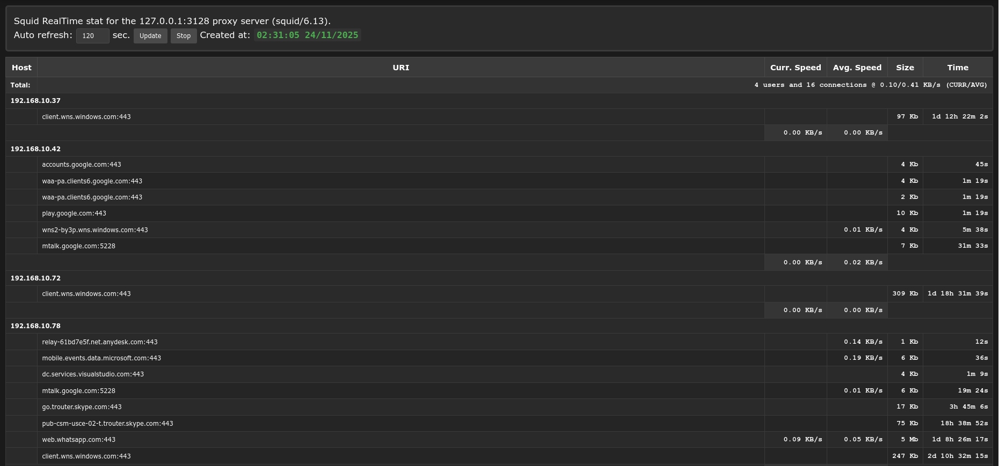](https://www.maravento.com/)

<table width="100%">
  <tr>
    <td style="width: 50%; vertical-align: top;">
     To switch between the light and dark themes, run the corresponding command:
    </td>
    <td style="width: 50%; vertical-align: top;">
     Para cambiar entre los temas claro y oscuro, ejecuta el comando correspondiente:
    </td>
  </tr>
</table>

```bash
# Dark Theme (Default)
sudo sed -i "s/sqstat\.css/sqstat-dark.css/" /var/www/proxymon/sqstat/sqstat.class.php
# Light Theme (Original)
sudo sed -i "s/sqstat-dark\.css/sqstat.css/" /var/www/proxymon/sqstat/sqstat.class.php
```

#### Auto Refresh

[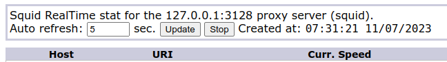](https://www.maravento.com/)

<table width="100%">
  <tr>
    <td style="width: 50%; vertical-align: top;">
     Select at least 5 seconds:
    </td>
    <td style="width: 50%; vertical-align: top;">
     Seleccione al menos 5 segundos:
    </td>
  </tr>
</table>

#### Reload

[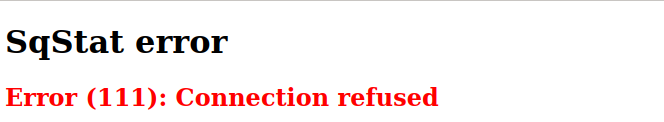](https://www.maravento.com/)

<table width="100%">
  <tr>
    <td style="width: 50%; vertical-align: top;">
     If <code>squid.conf</code> contains a large ACL, SqStat may temporarily lose its connection while Squid restarts or reloads its configuration. Wait for the service to become available again, then press F5 to refresh the page.
    </td>
    <td style="width: 50%; vertical-align: top;">
     Si <code>squid.conf</code> contiene una ACL extensa, SqStat puede perder la conexión mientras Squid se reinicia o recarga su configuración. Espera a que el servicio vuelva a estar disponible y luego pulsa F5 para actualizar la página.
    </td>
  </tr>
</table>

### ANALYZER (SquidAnalyzer)

[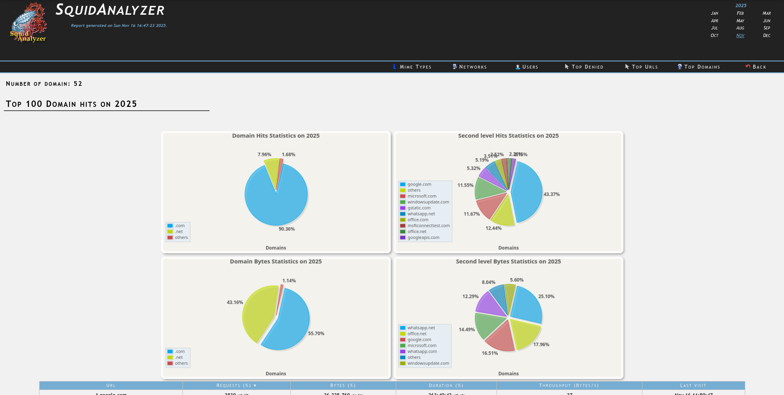](https://www.maravento.com/)

<table width="100%">
  <tr>
    <td style="width: 50%; vertical-align: top;">SquidAnalyzer parses Squid access logs and generates web reports about network traffic. Its views let you explore statistics by period, client, and domain, as well as traffic trends and transfer volumes.</td>
    <td style="width: 50%; vertical-align: top;">SquidAnalyzer analiza los registros de acceso de Squid y genera informes web sobre el tráfico. Sus vistas permiten explorar estadísticas por período, clientes y dominios, además de consultar tendencias y volúmenes de transferencia.</td>
  </tr>
</table>

#### Analyzer Task

<table width="100%">
  <tr>
    <td style="width: 50%; vertical-align: top;">
     The installer schedules SquidAnalyzer to generate reports every day at 2:00 a.m. To change the time, edit its entry in <code>/etc/cron.d/proxymon</code>.
    </td>
    <td style="width: 50%; vertical-align: top;">
     El instalador programa SquidAnalyzer para generar informes todos los días a las 2:00 a. m. Para cambiar la hora, edita su tarea en <code>/etc/cron.d/proxymon</code>.
    </td>
  </tr>
</table>

```bash
sudo -u www-data crontab -e
0 2 * * * cd /var/www/proxymon/squidanalyzer && perl -I. ./squid-analyzer -c etc/squidanalyzer.conf
```

### LOGVIEW

[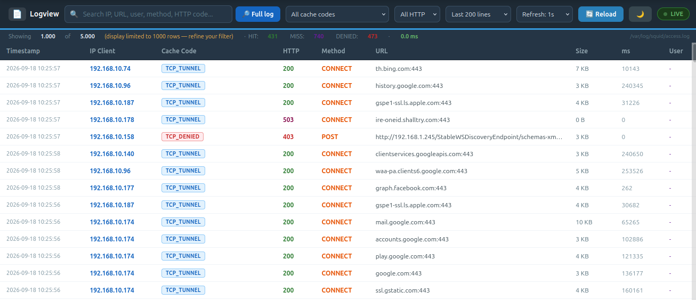](https://www.maravento.com/)

<table width="100%">
  <tr>
    <td style="width: 50%; vertical-align: top;">
     <b>LogView</b> displays new entries from <code>/var/log/squid/access.log</code> in a table that refreshes periodically. <br>
     <br>
     Search the loaded entries, filter by cache code or HTTP status, and sort columns. <br>
     <br>
     It also offers light and dark themes and a configurable refresh interval.
    </td>
    <td style="width: 50%; vertical-align: top;">
     <b>LogView</b> muestra las nuevas entradas de <code>/var/log/squid/access.log</code> en una tabla que se actualiza periódicamente. <br>
     <br>
     Puedes buscar entre las entradas cargadas, filtrar por código de caché o estado HTTP y ordenar las columnas. <br>
     <br>
     También ofrece temas claro y oscuro y permite ajustar el intervalo de actualización.
    </td>
  </tr>
</table>

[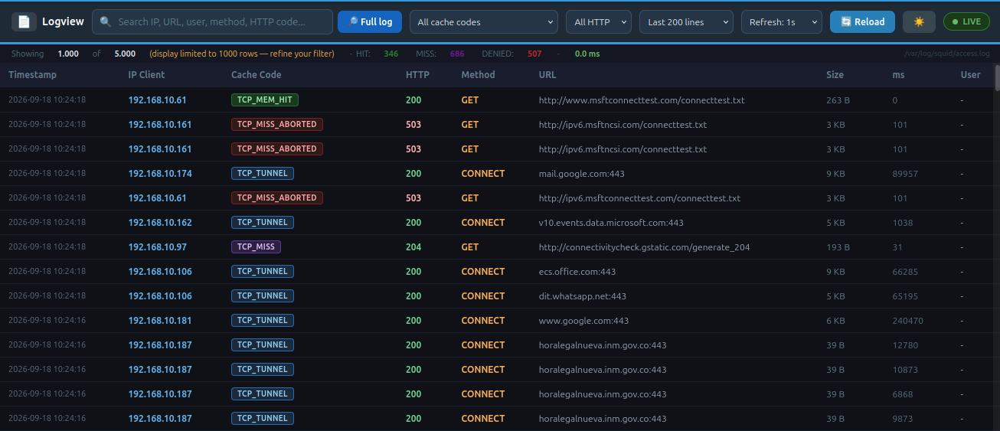](https://www.maravento.com/)

#### Controls

[](https://www.maravento.com/)

| Message | Description | Descripción |
| ------- | ----------- | ----------- |
| 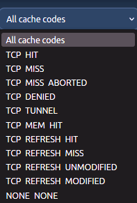 | Filters by Squid cache code: TCP_HIT (cached), TCP_MISS (origin), TCP_MISS_ABORTED (aborted), TCP_DENIED (blocked), TCP_TUNNEL (HTTPS), TCP_MEM_HIT (memory cache), TCP_REFRESH_HIT/MISS (revalidated), TCP_REFRESH_UNMODIFIED/MODIFIED (revalidation result), NONE_NONE (invalid/error request). | Filtra por código de caché de Squid: TCP_HIT (caché), TCP_MISS (origen), TCP_MISS_ABORTED (abortado), TCP_DENIED (bloqueado), TCP_TUNNEL (HTTPS), TCP_MEM_HIT (memoria), TCP_REFRESH_HIT/MISS (revalidado), TCP_REFRESH_UNMODIFIED/MODIFIED (resultado de revalidación), NONE_NONE (solicitud inválida/error). |
| 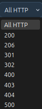 | Filters by HTTP response code: 200, 206, 301, 302, 400, 403, 404, 500. Color-coded: green (2xx), yellow (3xx), red (4xx/5xx). | Filtra por código de respuesta HTTP: 200, 206, 301, 302, 400, 403, 404, 500. Codificado por color: verde (2xx), amarillo (3xx), rojo (4xx/5xx). |
| 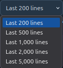 | Number of lines loaded from access.log on startup: 200, 500, 1,000, 2,000, or 5,000. | Número de líneas cargadas desde access.log al inicio: 200, 500, 1.000, 2.000 o 5.000. |
| 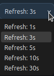 | Polling interval for new entries: 1s (default), 3s, 5s, 10s, or 30s. | Intervalo de sondeo para nuevas entradas: 1s (por defecto), 3s, 5s, 10s o 30s. |
|  | Live mode active. LogView polls access.log automatically and prepends new rows with a green animation. | Modo en vivo activo. LogView sondea el access.log automáticamente y agrega nuevas filas con animación verde. |
| 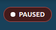 | Polling suspended. Indicator turns red and shows PAUSED. Click again to resume. | Sondeo suspendido. El indicador cambia a rojo y muestra PAUSED. Haga clic nuevamente para reanudar. |
|  | Dark Mode button. | Botón para activar el modo oscuro. |

#### Search Bar

[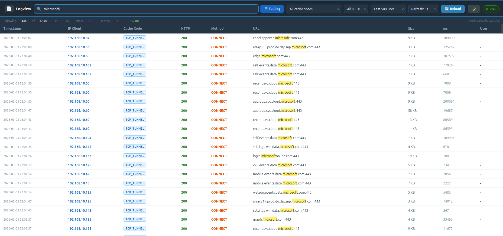](https://www.maravento.com/)

<table width="100%">
  <tr>
    <td style="width: 50%; vertical-align: top;">
      The search bar filters loaded entries by IP address, URL, user, HTTP method, cache code, or HTTP response code.
    </td>
    <td style="width: 50%; vertical-align: top;">
      La barra filtra las entradas cargadas por IP, URL, usuario, método HTTP, código de caché o código de respuesta HTTP.
    </td>
  </tr>
</table>

| Message | Description | Descripción |
| ------- | ----------- | ----------- |
|  | Select this option to search the full log. | Selecciona esta opción para buscar en el registro completo. |
| 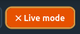 | Select this option to return to the live view. | Selecciona esta opción para volver a la vista en tiempo real. |

### AI

[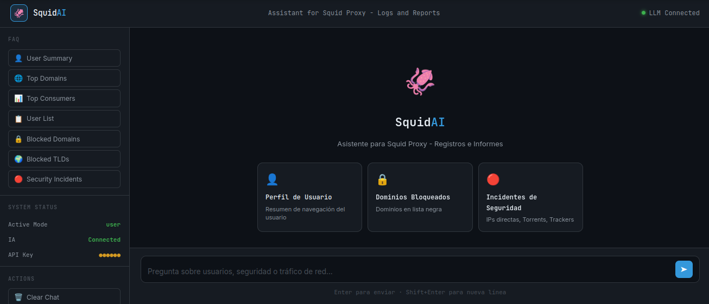](https://www.maravento.com/)

<table width="100%">
  <tr>
    <td style="width: 50%; vertical-align: top;">
      <b>SquidAI</b> is an assistant for network administrators. It uses BM25 to find relevant information in its data and a language model (LLM) to respond in natural language. It combines data from Squid, LightSquid reports, and ACL lists to help answer questions about user profiles, blocked activity, incidents, and network usage:
      <ul>
        <li><b>User profiles:</b> Activity summary, most visited domains and blacklist verification for specific users.</li>
        <li><b>Security incidents:</b> Detection of direct IP access, Torrent/P2P traffic, Log4Shell patterns, .onion sites and other suspicious behaviors.</li>
        <li><b>Blocked access:</b> Which IPs attempted to access blocked domains or TLDs.</li>
        <li><b>Network summary:</b> Top consumers, most visited domains, total bandwidth usage and unique IPs.</li>
        <li><b>Consumption thresholds:</b> Users exceeding specific GB limits (e.g. "more than 3 GB").</li>
        <li><b>User list:</b> Complete list of registered users from <code>realname.cfg</code> (excluding <code>skipuser.cfg</code>) of LightSquid.</li>
      </ul>
      The assistant responds in Spanish or English, matching the language of the question, and presents its findings in tables and detailed analyses.
    </td>
    <td style="width: 50%; vertical-align: top;">
      <b>SquidAI</b> es un asistente especializado para administradores de red. Usa BM25 para localizar información relevante en sus datos y un modelo de lenguaje (LLM) para responder en lenguaje natural. Combina respuestas basadas en datos de Squid, informes de LightSquid y listas ACL. Puede ayudar a consultar perfiles de usuario, actividad bloqueada, incidentes y consumo de la red:
      <ul>
        <li><b>Perfiles de usuario:</b> Resumen de actividad, dominios más visitados y verificación en lista negra para usuarios específicos.</li>
        <li><b>Incidentes de seguridad:</b> Detección de accesos a IPs directas, tráfico Torrent/P2P, patrones Log4Shell, sitios .onion y otros comportamientos sospechosos.</li>
        <li><b>Accesos bloqueados:</b> Qué IPs intentaron acceder a dominios o TLDs bloqueados.</li>
        <li><b>Resumen de red:</b> Principales consumidores, dominios más visitados, uso total de ancho de banda e IPs únicas.</li>
        <li><b>Umbrales de consumo:</b> Usuarios que superan límites específicos en GB (ej: "más de 3 GB").</li>
        <li><b>Lista de usuarios:</b> Lista completa de usuarios registrados desde <code>realname.cfg</code> (excluyendo <code>skipuser.cfg</code>) de LightSquid.</li>
      </ul>
      El asistente responde en español o inglés, según el idioma de la consulta, y presenta la información en tablas y análisis detallados.
    </td>
  </tr>
</table>

#### Examples

<table width="100%">
  <tr>
   <td style="width: 50%; vertical-align: top;">
      <b>User queries:</b><br>
      "Show me JOHN-SMITH activity"<br>
      "What did CARLOS-GARCIA do today?"<br>
      "Report for ACCOUNTING-DEPT"
    </td>
    <td style="width: 50%; vertical-align: top;">
      <b>Consultas de usuario:</b><br>
      "Muéstrame la actividad de JOHN-SMITH"<br>
      "¿Qué hizo CARLOS-GARCIA hoy?"<br>
      "Reporte de CONTABILIDAD"
    </td>
  </tr>
  <tr>
    <td style="width: 50%; vertical-align: top;">
      <b>Network queries:</b><br>
      "Top 10 most visited domains today"<br>
      "Who consumes the most bandwidth?"<br>
      "Users who exceeded 3 GB"
    </td>
    <td style="width: 50%; vertical-align: top;">
      <b>Consultas de red:</b><br>
      "Top 10 dominios más visitados hoy"<br>
      "¿Quién consume más ancho de banda?"<br>
      "Usuarios que superaron 3 GB"
    </td>
  </tr>
  <tr>
    <td style="width: 50%; vertical-align: top;">
      <b>Security queries:</b><br>
      "Are there security incidents?"<br>
      "Detect any threat today?"<br>
      "Is there torrent traffic?"
    </td>
    <td style="width: 50%; vertical-align: top;">
      <b>Consultas de seguridad:</b><br>
      "¿Hay incidentes de seguridad?"<br>
      "¿Detectas alguna amenaza hoy?"<br>
      "¿Hay tráfico de torrents?"
    </td>
  </tr>
  <tr>
    <td style="width: 50%; vertical-align: top;">
      <b>Blocked accesses:</b><br>
      "Which IPs accessed blocked domains?"<br>
      "Show blocked TLD accesses"
    </td>
    <td style="width: 50%; vertical-align: top;">
      <b>Accesos bloqueados:</b><br>
      "¿Qué IPs accedieron a dominios bloqueados?"<br>
      "Muestra accesos a TLDs bloqueados"
    </td>
  </tr>
  <tr>
    <td style="width: 50%; vertical-align: top;">
      <b>User list:</b><br>
      "List all registered users"<br>
      "Show me all users"
    </td>
    <td style="width: 50%; vertical-align: top;">
      <b>Lista de usuarios:</b><br>
      "Lista todos los usuarios registrados"<br>
      "Muéstrame todos los usuarios"
    </td>
  </tr>
</table>

> **Note:** The user names in the examples are illustrative. For the assistant to recognize them, they must exist in `realname.cfg` (and not be excluded in `skipuser.cfg`), where LightSquid stores the IP/Hostname mapping.
>
> **Nota:** Los nombres de usuario en los ejemplos son ilustrativos. Para que el asistente los reconozca, deben existir en `realname.cfg` (y no estar excluidos en `skipuser.cfg`), donde LightSquid almacena el mapeo de IP/Hostname.

#### Security Incident

<table width="100%">
  <tr>
    <td style="width: 50%; vertical-align: top;">
      <b>⚠️ Important:</b> For security incident detection, SquidAI uses <code>/etc/acl/squid/blockpatterns.txt</code> and direct IPv4 detection. Severity depends on the pattern type and number of matches; results can be classified as <b>CRITICAL</b>, <b>HIGH</b>, <b>MEDIUM</b>, or <b>LOW</b>.
    </td>
    <td style="width: 50%; vertical-align: top;">
      <b>⚠️ Importante:</b> Para la detección de incidentes de seguridad, SquidAI utiliza <code>/etc/acl/squid/blockpatterns.txt</code> y detección de IPv4 directa. La severidad depende del tipo de patrón y del número de coincidencias; los resultados pueden clasificarse como <b>CRITICAL</b>, <b>HIGH</b>, <b>MEDIUM</b> o <b>LOW</b>.
    </td>
  </tr>
</table>

#### API Configuration

<table width="100%">
  <tr>
    <td style="width: 50%; vertical-align: top;">
      <b>🔧 API Setup:</b> SquidAI requires an LLM provider to function. The configuration file is located outside the webroot for security:
      <pre><code>sudo nano /etc/proxymon/.env</code></pre>
      <b>Note:</b> <code>/etc/proxymon/</code> contains two files: <code>.env</code> (SquidAI LLM credentials) and <code>proxymon.env</code> (Bandata network and quota settings). Do not confuse them.
      Set your provider URL, API key and response format:
      <pre><code>LLM_URL=https://your-provider.com/endpoint
LLM_API_KEY=your_api_key
LLM_MODEL=model-name
LLM_RESPONSE_FORMAT=openai</code></pre>
      <b>Note:</b> the URL format depends on the provider.
      <ul>
        <li>Some providers include the account ID or the model name in the URL, for example Cloudflare: <code>…/accounts/ACCOUNT_ID/ai/run/MODEL_NAME</code>.</li>
        <li>Others use a fixed URL with the model in <code>LLM_MODEL</code>, for example OpenAI and Groq.</li>
        <li>Others embed the API key as a URL parameter, for example Gemini: <code>…?key=YOUR_KEY</code>.</li>
      </ul>
      Check the commented examples in the <code>.env</code> file for each provider's exact format. Leave <code>LLM_MODEL</code> empty if the model is already part of the URL.
      <br><br>
      <code>LLM_RESPONSE_FORMAT</code> tells the worker how to read the response: <code>openai</code> (most providers), <code>ollama</code> (local Ollama), or <code>gemini</code> (Google Gemini passthrough).
      <br><br>
      The file includes commented examples for: <b>Cloudflare Workers AI</b>, <b>OpenAI</b>, <b>Groq</b>, <b>OpenRouter</b>, <b>Together AI</b>, <b>Ollama</b> (local), <b>LM Studio</b> (local) and <b>Google Gemini</b>. Uncomment one block and fill in your credentials.
      <br><br>
      <b>🔒 Security:</b> The <code>.env</code> file is stored in <code>/etc/proxymon/</code>, outside the Apache webroot. Permissions are set to <code>640</code> (<code>root:www-data</code>), allowing root and processes in the <code>www-data</code> group, including Apache PHP, to read the file.
      <br><br>
      <b>🔄 Rate Limits &amp; Retries:</b> LLM APIs may experience congestion depending on demand. SquidAI implements an automatic retry mechanism: up to <b>4 attempts</b> with progressive delays (4s, 8s, 15s) before giving up. If the API is temporarily unavailable, the assistant will display retry messages. After all attempts fail, it will show a message (check table).
      <br><br>
    </td>
    <td style="width: 50%; vertical-align: top;">
      <b>🔧 Configuración de API:</b> SquidAI requiere un proveedor LLM para funcionar. El archivo de configuración se encuentra fuera del webroot por seguridad:
      <pre><code>sudo nano /etc/proxymon/.env</code></pre>
      <b>Nota:</b> <code>/etc/proxymon/</code> contiene dos archivos: <code>.env</code> (credenciales LLM de SquidAI) y <code>proxymon.env</code> (configuración de red y cuotas de Bandata). No los confunda.
      Configure la URL del proveedor, la API key y el formato de respuesta:
      <pre><code>LLM_URL=https://su-proveedor.com/endpoint
LLM_API_KEY=su_api_key
LLM_MODEL=nombre-del-modelo
LLM_RESPONSE_FORMAT=openai</code></pre>
      <b>Nota:</b> el formato de la URL depende del proveedor.
      <ul>
        <li>Algunos proveedores incluyen el Account ID o el nombre del modelo en la URL, por ejemplo Cloudflare: <code>…/accounts/ACCOUNT_ID/ai/run/NOMBRE_MODELO</code>.</li>
        <li>Otros usan una URL fija con el modelo en <code>LLM_MODEL</code>, por ejemplo OpenAI y Groq.</li>
        <li>Otros incrustan la clave de API como parámetro de la URL, por ejemplo Gemini: <code>…?key=SU_CLAVE</code>.</li>
      </ul>
      Consulte los ejemplos comentados del archivo <code>.env</code> para ver el formato exacto de cada proveedor. Deje <code>LLM_MODEL</code> vacío si el modelo ya forma parte de la URL.
      <br><br>
      <code>LLM_RESPONSE_FORMAT</code> indica al worker cómo leer la respuesta: <code>openai</code> (la mayoría de proveedores), <code>ollama</code> (Ollama local) o <code>gemini</code> (Google Gemini passthrough).
      <br><br>
      El archivo incluye ejemplos comentados para: <b>Cloudflare Workers AI</b>, <b>OpenAI</b>, <b>Groq</b>, <b>OpenRouter</b>, <b>Together AI</b>, <b>Ollama</b> (local), <b>LM Studio</b> (local) y <b>Google Gemini</b>. Descomente un bloque y complete sus credenciales.
      <br><br>
      <b>🔒 Seguridad:</b> El archivo <code>.env</code> se almacena en <code>/etc/proxymon/</code>, fuera del webroot de Apache. Los permisos son <code>640</code> (<code>root:www-data</code>): el archivo queda accesible para root y para los procesos del grupo <code>www-data</code>, incluido PHP de Apache.
      <br><br>
      <b>🔄 Límites de tasa y reintentos:</b> Las APIs LLM pueden experimentar congestión según la demanda. SquidAI implementa un mecanismo de reintento automático: hasta <b>4 intentos</b> con retardos progresivos (4s, 8s, 15s) antes de desistir. Si la API no está disponible temporalmente, el asistente mostrará mensajes de reintento y al finalizar mostrará un mensaje (ver tabla).
      <br><br>
    </td>
  </tr>
</table>

| Message | Description | Descripción |
| ------- | ----------- | ----------- |
|  | Example of the automatic retry message. | Ejemplo del mensaje de reintento automático. |
| 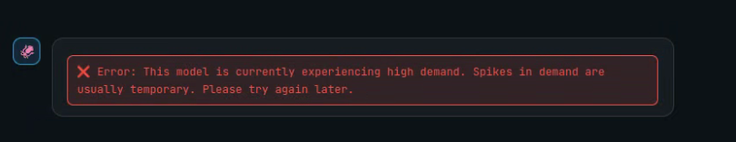 | Example shown when the API is unavailable. | Ejemplo de API no disponible. |

#### LLM status

<table width="100%">
  <tr>
    <td style="width: 50%; vertical-align: top;">
    <b>🔌 LLM Status:</b> The LED indicates whether the connection is checking, connected, or offline.
    </td>
    <td style="width: 50%; vertical-align: top;">
    <b>🔌 Estado LLM:</b> El LED indica si la conexión se está verificando, está conectada o está fuera de línea.
    </td>
  </tr>
</table>

| Message | Description | Descripción |
| ------- | ----------- | ----------- |
|  | Checking LLM connection | Verificando conexión con el LLM |
|  | LLM connected and ready | LLM conectado y listo |
|  | LLM unreachable or offline | LLM inaccesible o fuera de línea |

### TOOLS

| Description | Descripción |
| --- | --- |
| Command-line utilities are installed in `/etc/proxymon/tools` and run from a terminal. The HTML reports they generate can be viewed from the panel. | Las utilidades de consola se instalan en `/etc/proxymon/tools` y se ejecutan desde la terminal. Los informes HTML que generan se pueden consultar desde el panel. |

#### Squidtool

| Description | Descripción |
| --- | --- |
| Squidtool is a command-line utility with two functions: generate a traffic report and search Squid logs. Run it with: | Squidtool es una utilidad de consola con dos funciones: generar un informe de tráfico y buscar términos en los registros de Squid. Se ejecuta con: |

```bash
sudo /etc/proxymon/tools/squidtool.sh
```

> Each function generates an HTML report and replaces the previous report of the same type, so only the latest result is kept. The reports are written to `/etc/proxymon/tools/reports`, outside the Apache webroot, and the panel serves them read-only under the same loopback-only restriction. Tool activity is logged in `/etc/proxymon/tools/squidtool.log`.
>
> Cada función genera un informe HTML y reemplaza el anterior del mismo tipo; solo se conserva el resultado más reciente. Los informes se escriben en `/etc/proxymon/tools/reports`, fuera del webroot de Apache, y el panel los publica en modo lectura con la misma restricción a loopback. La herramienta registra su actividad en `/etc/proxymon/tools/squidtool.log`.

##### Traffic Report

[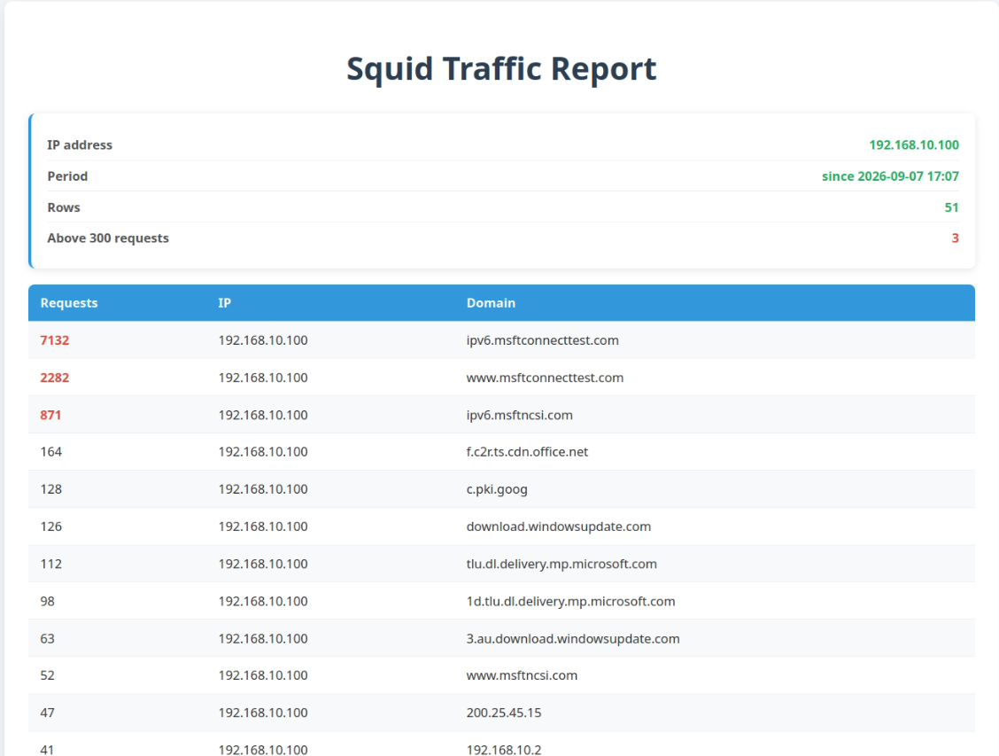](https://www.maravento.com/)

| Description | Descripción |
| --- | --- |
| Analyzes the requests recorded by Squid, grouping them by **client IP and requested domain**. It allows selecting a single IP or analyzing every IP, and defining the period to review. The analysis covers the current `access.log` and its rotated or compressed files. Requests are counted and sorted from the most active to the least. When every IP is analyzed, entries below 20 requests are excluded. Entries reaching or exceeding 300 requests are shown as alerts. The result is written to `squid_traffic.html`. | Analiza las solicitudes registradas por Squid, agrupándolas por **IP de cliente y dominio solicitado**. Permite seleccionar una IP concreta o analizar todas las IP y definir el período que se desea revisar. El análisis incluye el `access.log` actual y sus archivos rotados o comprimidos. Las solicitudes se contabilizan y se ordenan de mayor a menor actividad. Cuando se analizan todas las IP, se excluyen las entradas con menos de 20 solicitudes. Las entradas que alcanzan o superan las 300 solicitudes se muestran como alertas. El resultado se genera en `squid_traffic.html`. |

##### Log Search

[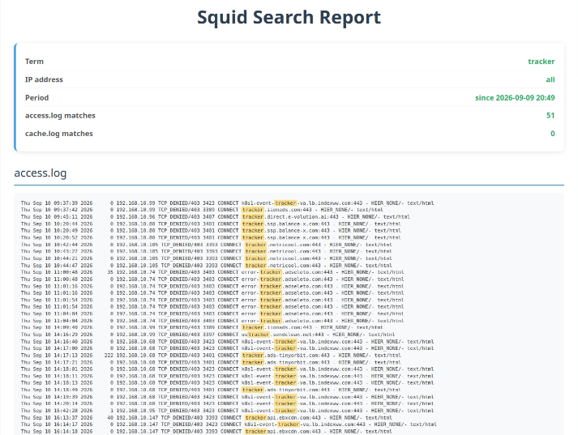](https://www.maravento.com/)

| Description | Descripción |
| --- | --- |
| Searches for a **specific term** in the `access.log` and `cache.log` records, without distinguishing between uppercase and lowercase. The text is matched literally, not as a regular expression, so characters such as `?`, `&`, `=` or `*` are searched as typed. The search includes the current, rotated and compressed files. In `access.log` it allows filtering by **client IP** and setting the search period. In `cache.log` the IP filter does not apply, because that record does not contain the client IP. The results from `access.log` and `cache.log` are shown separately, along with the number of matches found in each record. The result is written to `squid_search.html`.<br><br>For `cache.log` to record the ACL decisions -- which rule allowed or blocked each request -- Squid must have `debug_options ALL,1 33,2 28,9` enabled in `squid.conf`. Without it the search still works, but that record only holds the usual service messages. Keep in mind that this directive makes `cache.log` grow considerably. | Busca un **término específico** en los registros `access.log` y `cache.log`, sin distinguir entre mayúsculas y minúsculas. El texto se busca de forma literal, no como expresión regular, de modo que caracteres como `?`, `&`, `=` o `*` se buscan tal cual se escriben. La búsqueda incluye los archivos actuales, rotados y comprimidos. En `access.log` permite filtrar por **IP de cliente** y establecer el período de búsqueda. En `cache.log` no se aplica el filtro por IP porque este registro no contiene la IP del cliente. Los resultados de `access.log` y `cache.log` se muestran por separado, junto con la cantidad de coincidencias encontradas en cada registro. El resultado se genera en `squid_search.html`.<br><br>Para que `cache.log` registre las decisiones de ACL -- qué regla permitió o bloqueó cada petición -- Squid debe tener activada la directiva `debug_options ALL,1 33,2 28,9` en `squid.conf`. Sin ella la búsqueda sigue funcionando, pero ese registro solo contendrá los mensajes habituales del servicio. Tenga en cuenta que esa directiva hace crecer `cache.log` de forma considerable. |

#### pmbk

<table>
  <tr>
    <td style="width: 50%; vertical-align: top;">
      <code>pmbk.sh</code> creates a ZIP archive with the Proxy Monitor installation and configuration, including the paths listed below:
      <ul>
        <li>The project install tree, <code>/var/www/proxymon</code>, and <code>/etc/proxymon</code>.</li>
        <li>The MAC and Squid ACL lists.</li>
        <li>The Apache vhosts and the Apache and PHP hardening files.</li>
        <li>SARG's configuration and its <code>usertab</code>.</li>
        <li>The <code>bandata</code> logrotate configuration.</li>
        <li>The project's <code>/etc/cron.d/proxymon</code> entry and the <code>php.ini</code> in use.</li>
      </ul>
      Paths that do not exist are skipped. <code>pmsetup.sh update</code> runs this backup before updating project files.
    </td>
    <td style="width: 50%; vertical-align: top;">
      <code>pmbk.sh</code> crea un archivo ZIP con la instalación y configuración de Proxy Monitor, incluidas las rutas que se enumeran a continuación:
      <ul>
        <li>El árbol de instalación del proyecto, <code>/var/www/proxymon</code>, y <code>/etc/proxymon</code>.</li>
        <li>Las listas ACL de MAC y de Squid.</li>
        <li>Los vhosts de Apache y los archivos de hardening de Apache y PHP.</li>
        <li>La configuración de SARG y su <code>usertab</code>.</li>
        <li>La configuración de logrotate de <code>bandata</code>.</li>
        <li>La entrada <code>/etc/cron.d/proxymon</code> del proyecto y el <code>php.ini</code> en uso.</li>
      </ul>
      Las rutas que no existan se omiten. <code>pmsetup.sh update</code> ejecuta esta copia de seguridad antes de actualizar los archivos del proyecto.
    </td>
  </tr>
</table>

| Command | Description | Descripción |
|---|---|---|
| `sudo bash pmbk.sh` | Create a backup now | Crear una copia ahora |
| `sudo bash pmbk.sh install` | Register the `@monthly` cron entry | Registrar la entrada mensual en cron |
| `sudo bash pmbk.sh uninstall` | Remove the cron entry, keeping the archives | Quitar la entrada de cron, conservando los comprimidos |

> Backs up Proxymon into `/etc/bak/proxymon/pmbk_<YYYYMMDD_HHMMSS>.zip`, keeping up to 3 archives. `pmsetup.sh install` registers the monthly cron entry automatically; `pmsetup.sh uninstall` removes it before removing the project. Restore by unzipping it over `/`.
>
> Respalda Proxymon en `/etc/bak/proxymon/pmbk_<YYYYMMDD_HHMMSS>.zip`, conservando hasta 3 comprimidos. `pmsetup.sh install` registra la entrada mensual de cron automáticamente; `pmsetup.sh uninstall` la elimina antes de quitar el proyecto. Para restaurar, descomprímalo sobre `/`.

### PROXYMON LOGS

```bash
/var/log/apache2/proxymon_access.log
/var/log/apache2/proxymon_error.log
/var/log/bandata.log                 # Rotated via /etc/logrotate.d/bandata
pmsetup.log                          # In pmsetup.sh's own directory, rewritten on each run
/etc/proxymon/tools/squidtool.log    # In squidtool.sh's own directory, rewritten on each run
```

## ORIGINAL PROJECTS

---

<table width="100%">
  <tr>
    <td style="width: 50%; vertical-align: top;">
     Proxy Monitor preserves and integrates four Squid analysis tools that no longer receive maintenance: LightSquid, SARG, SqStat and SquidAnalyzer. The table lists their official versions and available community updates.
    </td>
    <td style="width: 50%; vertical-align: top;">
     Proxy Monitor preserva e integra cuatro herramientas de análisis para Squid que ya no reciben mantenimiento: LightSquid, SARG, SqStat y SquidAnalyzer. La tabla muestra sus versiones oficiales y las actualizaciones comunitarias disponibles.
    </td>
  </tr>
</table>

| Project / Developer | Last Official Version | Unofficial Update | Additional |
| :-----------------: | :-------------------: | :---------------: | :--------: |
| **LightSquid** | [v1.8-7 (2009)](https://lightsquid.sourceforge.net/) | [v1.8.1 (2021)](https://github.com/finisky/lightsquid-1.8.1) | [Metro_tpl (2020)](https://www.sysadminsdecuba.com/2020/09/lightsquid/) |
| **SARG** | [v2.4.0 (2020-01-16)](https://sourceforge.net/projects/sarg/) | N/A | N/A |
| [Sqstat - Alex Samorukov](https://samm.kiev.ua/sqstat/) | [v1.20 (2006)](https://sourceforge.net/projects/sqstat/files/) | N/A | N/A |
| [SquidAnalyzer](https://squidanalyzer.darold.net/download.html) [github](https://github.com/darold/squidanalyzer) | [v6.6 (2017)](https://sourceforge.net/projects/squid-report/files/squid-report/6.6/) | N/A | N/A |

## ⚠️ WARNING: NETWORK ACCESS

---

<table>
  <tr>
    <td style="width: 50%; vertical-align: top;">
      This project is designed for use on a local network (LAN). It does not include the security hardening needed for direct exposure to the internet. If internet access is required, an on-demand tunnel is recommended instead of opening ports directly. This enables access when needed without leaving the server permanently exposed.
    </td>
    <td style="width: 50%; vertical-align: top;">
      Este proyecto está diseñado para usarse en una red local (LAN). No cuenta con las medidas de seguridad necesarias para exponerlo directamente a Internet. Si se requiere acceso desde Internet, se recomienda utilizar un túnel bajo demanda en lugar de abrir puertos directamente. Así, el acceso se habilita cuando hace falta y el servidor no queda expuesto permanentemente.
    </td>
  </tr>
</table>

**Optional tunnel:**
- [Cloudflare Tunnel with Zero Trust Recommended](https://raw.githubusercontent.com/maravento/vault/master/scripts/bash/cftunnel.sh)

## NOTICE

---

<table width="100%">
  <tr>
    <td style="width: 50%; vertical-align: top;">
      <strong>This repository</strong>
      <ul>
        <li>May include third-party components.</li>
        <li>Does not accept Pull Requests. Changes must be proposed via Issues.</li>
      </ul>
    </td>
    <td style="width: 50%; vertical-align: top;">
      <strong>Este repositorio</strong>
      <ul>
        <li>Puede incluir componentes de terceros.</li>
        <li>No acepta Pull Requests. Los cambios deben proponerse mediante Issues.</li>
      </ul>
    </td>
  </tr>
</table>

## SPONSOR THIS PROJECT

---

[](https://paypal.me/maravento)

## PROJECT LICENSES

---

<table width="100%">
  <tr>
    <td style="width: 50%; vertical-align: top;">
      This project uses a dual-licensing model to balance software freedom with content protection:
    </td>
    <td style="width: 50%; vertical-align: top;">
      Este proyecto utiliza un modelo de licencia dual para equilibrar la libertad del software con la protección del contenido:
    </td>
  </tr>
</table>

| Content | Licensed Under |
|---|---|
|Scripts, Binaries, Infrastructure|[](LICENSE)|
|RAG, Workers, Specialized Modules, Docs|[](docs/LICENSE-CC-BY-NC-ND-4.0.md)|

## DISCLAIMER

---

THE SOFTWARE IS PROVIDED "AS IS", WITHOUT WARRANTY OF ANY KIND, EXPRESS OR IMPLIED, INCLUDING BUT NOT LIMITED TO THE WARRANTIES OF MERCHANTABILITY, FITNESS FOR A PARTICULAR PURPOSE AND NONINFRINGEMENT. IN NO EVENT SHALL THE AUTHORS OR COPYRIGHT HOLDERS BE LIABLE FOR ANY CLAIM, DAMAGES OR OTHER LIABILITY, WHETHER IN AN ACTION OF CONTRACT, TORT OR OTHERWISE, ARISING FROM, OUT OF OR IN CONNECTION WITH THE SOFTWARE OR THE USE OR OTHER DEALINGS IN THE SOFTWARE.
